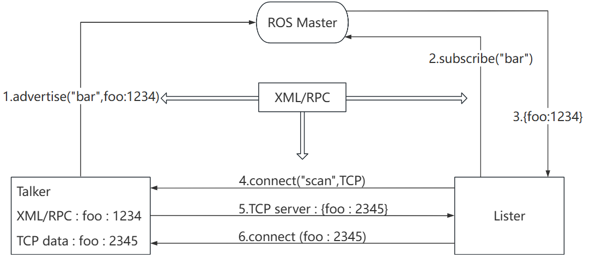
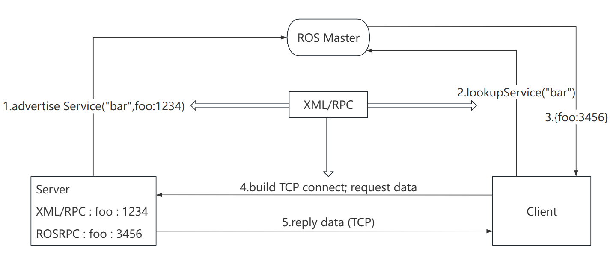
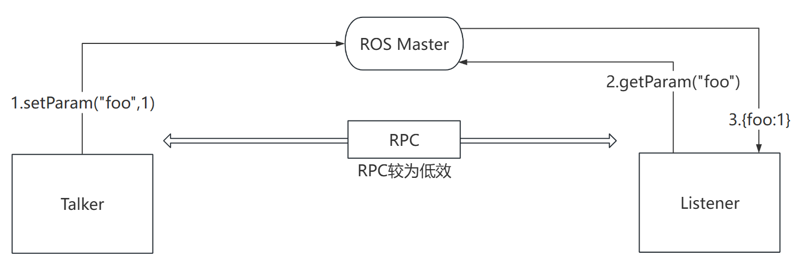

# 话题通信

## 话题通信理论模型



**(利用XML进行信息的序列化和反序列化)**

1. Talker向Mater注册信息包括话题名（topic）和RPC地址
2. Listener注册信息并订阅话题
3. ROS Master匹配信息并通过RPC将Talker的RPC地址发给Listener
4. 5. 6. 利用RPC的通信进行TCP的3次握手建立TCP连接

**关注点: **

（1）话题设置

（2）发布者，订阅者实现

（3）消息载体

（其它大部分步骤已封装实现）


## 实现步骤

**发布方：**

1. 包含头文件

   ```c++
   #include "ros/ros.h"
   #include "std_msgs/String.h" //ros普通文本类型的消息
   ```

2. 初始化 ros 节点 `ros::init(argc,argv,"talker");`

3. 创建节点句柄 ` ros::NodeHandle nh_name;`

4. 创建发布者对象 

   ```c++
   ros::Publisher 发布者对象名 = 句柄名.advertise<信息类型>("话题名",队列大小);
   ros::Publisher pub = nh.advertise<std_msgs::String>("topic",10);
   ```

5. 编写发布逻辑并发布信息

   ```c++
   ros::ok(); //判断节点是否存活，返回bool值
   std_msgs::String msg; //建立消息类型
   msg.data = "ABC"; //准备发布的消息
   pub.publish(msg); //发布消息
   ros::Rate rate(10); //设置消息发布频率为10HZ(一秒十次)
   rate.sleep(); //发布消息后调用该函数休眠进程
   ros::spinOnce(); //官方推荐的回调函数（在函数中使用回调一次）
   
   //在字符流中进行信息拼接
       std::string stream ss;
   	ss << "hello --> " << num;
   	ss.str().c_str()； //将字符流中的信息转化为字符串
           
   //避免中文无法识别，在main中加入
       setlocale(LC_ALL,"");
   ```

**订阅方：**

1. 2. 3. 同发布方

4. 创建订阅者对象

   ```c++
   ros::Subscriber sub = nh.subscribe("ropic", 队列大小, 信息处理函数);
   ```

5. 处理订阅到的数据

   ```c++
   void doMsgs(const std_msgs::String::ConstPtr &msg){
       ···
   }
   
   //回调函数（非循环用）
   ros::spin()
   ```


## 问题及解决

订阅时前几条数据丢失，原因是发送数据时 publisher 还未注册完毕

解决：注册后，加入`ros::Duration(3.0).sleep() //ros持续3秒休眠延迟信息发送` 

---

# 话题通信自定义msg

## 按固定格式在固定位置创建msg文件

1. 在功能包下新建 msg 文件夹，新建 name.msg 文件

2. 编写

   msgs 只是简单的文本文件，每行具有字段类型和字段名称，可以使用的字段类型有：

   - int8, int16, int32, int64 (或者无符号类型: uint*)
   - float32, float64
   - string
   - time, duration
   - other msg files （其他msg文件）
   - variable-length array[] and fixed-length array[C] (边长和定长数组)

   ROS中还有一种特殊类型：`Header`，标头包含时间戳和ROS中常用的坐标帧信息。会经常看到msg文件的第一行具有`Header标头`。

3. 例子

   ```c++
   string name
   uint16 age
   float64 height
   ```


## 编辑配置文件

***package.xml*中添加编译依赖与执行依赖**

```xml
<build_depend>message_generation</build_depend>
<exec_depend>message_runtime</exec_depend>
<!-- 
exce_depend 以前对应的是 run_depend 现在非法
-->
```

***CMakeLists.txt*编辑 msg 相关配置**

```cmake
# catkin编译需要的组件中加入 message_generation，而message_generation依赖于 std_msgs，故必须有 std_msgs
find_package(catkin REQUIRED COMPONENTS
  roscpp
  rospy
  std_msgs
  message_generation
)

# 配置 msg 源文件
add_message_files(
  FILES
  Person.msg
)

# 生成自定义 msg 时所需的依赖列表
generate_messages(
  DEPENDENCIES
  std_msgs
)

# 本项在文件中原本为被注释项，应该是在生成功能包添加依赖时 catkin 自动设置默认为创建以来，现发生变动故添加各项依赖（含创建依赖和新加依赖）
# 执行时依赖
catkin_package(
#  INCLUDE_DIRS include
#  LIBRARIES demo02_talker_listener
  CATKIN_DEPENDS roscpp rospy std_msgs message_runtime
#  DEPENDS system_lib
)
```

**编译**

c++：产生的中间文件可以在 devel 文件夹下的 include 文件夹中的 xxx.h

python：产生的中间文件可以在 devel 文件夹下的 lib 文件夹中的 xxx.h

## 自定义msg文件的使用

1. 在xxx.cpp文体中加入`# include "功能包名/name.h"`

2. 修改 CMakeList

   需要添加 **add_dependencies** 用以设置所依赖的消息相关的中间文件。

   ```cmake
   add_executable(person_talker src/person_talker.cpp)
   add_executable(person_listener src/person_listener.cpp)
   
   
   # 多一个修改项，添加依赖
   add_dependencies(person_talker ${PROJECT_NAME}_generate_messages_cpp)
   add_dependencies(person_listener ${PROJECT_NAME}_generate_messages_cpp)
   
   
   target_link_libraries(person_talker
     ${catkin_LIBRARIES}
   )
   target_link_libraries(person_listener
     ${catkin_LIBRARIES}
   )
   ```

3. 在 vscode 中使用可以配置一下 c_cpp_properties.json 来实现代码提示并避免抛异常将 head 文件路径添加到 includePath 中，在 vscode 终端中使用 `pwd` 命令可显示当前文件所在位置的路径

---

# 服务通信

**概念：**以**请求响应**的方式实现不同节点之间数据交互的通信模式

**作用：**用于偶然性、对实时性有要求，有一定逻辑处理需求的数据传输场景



1. 2. 向 ROS Master 注册自身信息，包括请求或提供的服务名，Master会将信息加入注册表中

3. Master 进行信息匹配，并向 Client 发送 Server 的 TCP 地址

4. 
   建立 TCP 连接 Client 向 Server 提交请求
5. 接收解析请求信息并响应结果返回给 Client

## 自定义 srv 文件

### 1.按固定格式创建 srv 文件

1. 功能包下新建 srv 文件夹，新建 .srv 文件

2. 编辑 srv 文件

   （1）可使用类型同 .msg 文件

   （2）请求与响应按 `---` 分隔

```c++
# 客户端请求时发送的两个数字
int32 num1
int32 num2
---
# 服务器响应发送的数据
int32 sum
```

### 2.编辑配置文件

**package.xml**中添加编译依赖与执行依赖

```xml
<build_depend>message_generation</build_depend>
<exec_depend>message_runtime</exec_depend>
<!-- 
exce_depend 以前对应的是 run_depend 现在非法
-->
```

**CMakeLists.txt**编辑 srv 相关配置

```cmake
find_package(catkin REQUIRED COMPONENTS
  roscpp
  rospy
  std_msgs
  message_generation
)
# 需要加入 message_generation,必须有 std_msgs

add_service_files(
  FILES
  xxx.srv
)

generate_messages(
  DEPENDENCIES
  std_msgs
)

# 注意: 官网没有在 catkin_package 中配置 message_runtime,经测试配置也可以
# 执行时依赖
catkin_package(
#  INCLUDE_DIRS include
#  LIBRARIES demo02_talker_listener
  CATKIN_DEPENDS roscpp rospy std_msgs message_runtime
#  DEPENDS system_lib
)
```

编译后的中间文件查看：C++ 需要调用的中间文件(.../工作空间/devel/include/包名/xxx.h)

## 自定义 srv 文件的使用

### 服务器实现

1. 包含头文件

   `# include "功能包名/SrvName.h"`

2. 初始化 ros 节点，创建 ros 句柄

3. 创建服务对象

   `ros::ServiceServer server = nh.advertiseService("服务名",doReq);`

4. 处理请求并响应

   ```c++
   bool xxx(功能包名::SrvName::Request &req, 功能包名::SrvName::Response &resp){
   	//可以通过 req.xx 来访问 srv 文件的请求数据
   	//可以通过 resp.xx 来准备 srv 文件的响应数据
       ···
       ROS_INFO(""); //ROS信息打印
       ROS_ERROR("···"); //用于异常反馈
   }
   ```

   

5. 回调函数

   `ros::spin();`

### 客户端实现

1. 包含头文件

   `# include "功能包名/SrvName.h"`

2. 初始化 ros 节点，创建 ros 句柄

3. 创建客户端对象

   `ros::Service Client = nh.serviceclient<功能包名::SrvName>("服务名")`

4. 组织请求数据

   ```c++
   功能包名::SrvName xxx; //定义srv变量
   //设置请求数据
   xxx.request.aa = aaa; 
   xxx.request.bb = bbb; 
   ```

5. 发送请求返回 bool 值标记是否成功

   `bool flag = 客户端对象.call(srv变量);`

6. 处理请求

   失败时多用 **ROS_ERROR** 打印日志，`return 1;`

### 优化

1. 动态传参

   **启动命令：**`rosrun 功能包名 映射名 参数1 参数2 ···`

   main 的 **argc** 为传递的参数个数

   ```cpp
   功能包::SrvName xxx;
   xxx.request.aa = atoi(argv[1]);
   xxx.request.bb = atoi(argv[2]);
   ···
   ```

2. 处理客户端先启动时的运行失败

   在客户端第5步发送请求前，添加

   ```c++
   //方法1
   ros::service::waitForService("服务名");
   //方法2
   client.waitForExistence();
   ```

   以阻塞进程，当服务启动后才继续执行

### 修改CMakeList.txt

```cmake
add_executable(AddInts_Server src/AddInts_Server.cpp)
add_executable(AddInts_Client src/AddInts_Client.cpp)


add_dependencies(AddInts_Server ${PROJECT_NAME}_gencpp)
add_dependencies(AddInts_Client ${PROJECT_NAME}_gencpp)


target_link_libraries(AddInts_Server
  ${catkin_LIBRARIES}
)
target_link_libraries(AddInts_Client
  ${catkin_LIBRARIES}
)
```

# 参数服务器

**定义：**以共享的方式实现不同节点之间的数据交互的通信模式，在参数服务器中存储一些多节点共享数据，各节点皆可存取（参数服务器不是为高性能而设计的）

## 参数服务器理论模型



1. Talker 设置参数：Talker 通过 RPC 向参数服务器发送参数(包括参数名与参数值)，ROS Master 将参数保存到参数列表中。

2. Listener 获取参数：Listener 通过 RPC 向参数服务器发送参数查找请求，请求中包含要查找的参数名。

3. ROS Master 向 Listener 发送参数值：ROS Master 根据步骤2请求提供的参数名查找参数值，并将查询结果通过 RPC 发送给 Listener。

## 设置、修改、删除参数

在 roscpp 中提供了两套 API 实现参数操作（可设置的参数：整形、浮点、字符串、bool、列表、字典等类型参数）

1. 获取参数

   ```c++
   //方法1
   ros::NodeHandle nh;
   nh.setParam("键",值));
   //方法2
   ros::param::set("键","值");
   
   //设置演示
   nh.setParam("nh_int",10); //整型
   nh.setParam("nh_double",3.14); //浮点型s
   
   ros::param::set("param_int",20);
   ```

2. 修改参数

   ```c++
   //修改演示(相同的键，不同的值)
   nh.setParam("nh_int",10000);
   
   ros::param::set("param_int",10000);
   ```

3. 删除参数

   ```c++
   //删除演示
   nh.deleteParam("key");
   
   ros::param::del("key");
   ```

## 获取参数

在 roscpp 中提供了两套 API 实现参数操作`ros::NodeHandle`和`ros::param`

```c++
ros::NodeHandle nh;

nh.param(键,默认值);
//存在，返回对应结果，否则返回默认值

nh.getParam(键,存储结果的变量);
//存在,返回 true,且将值赋值给参数2
//若果键不存在，那么返回值为 false，且不为参数2赋值

nh.getParamCached(键,存储结果的变量);
//提高变量获取效率
//存在,返回 true,且将值赋值给参数2
//若果键不存在，那么返回值为 false，且不为参数2赋值

nh.getParamNames(std::vector<std::string>);
//获取所有的键,并存储在参数 vector 中 

nh.hasParam(键);
//是否包含某个键，存在返回 true，否则返回 false

nh.searchParam(参数1，参数2);
//搜索键，参数1是被搜索的键，参数2存储搜索结果的变量

/*==========ros::param的用法同NodeHandle==========*/
ros::param::param(键,默认值);
//存在，返回对应结果，否则返回默认值
······
```

---

# ros常用命令

## rosnode

rosnode 是用于获取节点信息的命令

```powershell
rosnode ping    测试到节点的连接状态
rosnode list    列出活动节点
rosnode info    打印节点信息
rosnode machine    列出指定设备上节点
rosnode kill    杀死某个节点
rosnode cleanup    清除不可连接的节点
```

- rosnode ping

  测试到节点的连接状态

- rosnode list

  列出活动节点

- rosnode info

  打印节点信息

- rosnode machine

  列出指定设备上的节点

- rosnode kill

  杀死某个节点

- rosnode cleanup

  清除无用节点，启动乌龟节点，然后 ctrl + c 关闭，该节点并没被彻底清除，可以使用 cleanup 清除节点

## rostopic

rostopic 命令行工具，用于显示有关 ROS 主题的调试信息，包括发布者，订阅者，发布频率和 ROS 消息。它还包含一个实验性 Python 库，用于动态获取有关主题的信息并与之交互。

```powershell
rostopic bw     显示主题使用的带宽
rostopic delay  显示带有 header 的主题延迟
rostopic echo   打印消息到屏幕
rostopic find   根据类型查找主题
rostopic hz     显示主题的发布频率
rostopic info   显示主题相关信息
rostopic list   显示所有活动状态下的主题
rostopic pub    将数据发布到主题
rostopic type   打印主题类型
```

- **rostopic list**(-v)

  直接调用即可，控制台将打印当前运行状态下的主题名称

  rostopic list -v : 获取话题详情(比如列出：发布者和订阅者个数...)

- **rostopic pub**

  可以直接调用命令向订阅者发布消息

  为roboware 自动生成的 发布/订阅 模型案例中的 订阅者 发布一条字符串

  ```powershell
  rostopic pub /主题名称 消息类型 消息内容
  rostopic pub /chatter std_msgs gagaxixi
  ```

- **rostpic echo**

  获取指定话题当前发布的消息

- **rostopic info**

  获取当前话题的小关信息

  消息类型

  发布者信息

  订阅者信息

- **rostopic type**

  列出话题的消息类型

- **rostopic find 消息类型**

  根据消息类型查找话题

- **rostopic delay**

  列出消息头信息

- **rostopic hz**

  列出消息发布频率

- **rostopic bw**

  列出消息发布带宽

## rosmsg

rosmsg 是用于显示有关 ROS 消息类型的 信息的命令行工具。

**rosmsg 演示**

```powershell
rosmsg show    显示消息描述
rosmsg info    显示消息信息
rosmsg list    列出所有消息
rosmsg md5    显示 md5 加密后的消息
rosmsg package    显示某个功能包下的所有消息
rosmsg packages    列出包含消息的功能包
```

- rosmsg list

  会列出当前 ROS 中的所有 msg

- rosmsg packages

  列出包含消息的所有包

- rosmsg package

  列出某个包下的所有msg

  ```powershell
  //rosmsg package 包名 
  rosmsg package turtlesim
  ```

- rosmsg show

  显示消息描述

  ```powershell
  //rosmsg show 消息名称
  rosmsg show turtlesim/Pose
  结果:
  float32 x
  float32 y
  float32 theta
  float32 linear_velocity
  float32 angular_velocity
  ```

- rosmsg info

  作用与 rosmsg show 一样

## rosservice

rosservice 包含用于列出和查询的 rosservice 命令行工具。

调用部分服务时，如果对相关工作空间没有配置 path，需要进入工作空间调用 source ./devel/setup.bash

```powershell
rosservice args 打印服务参数
rosservice call    使用提供的参数调用服务
rosservice find    按照服务类型查找服务
rosservice info    打印有关服务的信息
rosservice list    列出所有活动的服务
rosservice type    打印服务类型
rosservice uri    打印服务的 ROSRPC uri
```

- rosservice list

  列出所有活动的 service

  ```powershell
  ~ rosservice list
  
  /clear
  /kill
  /listener/get_loggers
  /listener/set_logger_level
  /reset
  /rosout/get_loggers
  /rosout/set_logger_level
  /rostopic_4985_1578723066421/get_loggers
  /rostopic_4985_1578723066421/set_logger_level
  /rostopic_5582_1578724343069/get_loggers
  /rostopic_5582_1578724343069/set_logger_level
  /spawn
  /turtle1/set_pen
  /turtle1/teleport_absolute
  /turtle1/teleport_relative
  /turtlesim/get_loggers
  /turtlesim/set_logger_level
  ```

- rosservice args

  打印服务参数

  ```powershell
  rosservice args /spawn
  x y theta name
  ```

- rosservice call

  调用服务

  为小乌龟的案例生成一只新的乌龟

  ```powershell
  rosservice call /spawn "x: 1.0
  
  y: 2.0
  theta: 0.0
  name: 'xxx'"
  name: "xxx"
  
  //生成一只叫 xxx 的乌龟
  ```

- rosservice find

  根据消息类型获取话题

- rosservice info

  获取服务话题详情

- rosservice type

  获取消息类型

- rosservice uri

  获取服务器 uri

## rossrv

rossrv 是用于显示有关 ROS 服务类型的信息的命令行工具，与 rosmsg 使用语法高度雷同。

```powershell
rossrv show    显示服务消息详情
rossrv info    显示服务消息相关信息
rossrv list    列出所有服务信息
rossrv md5    显示 md5 加密后的服务消息
rossrv package    显示某个包下所有服务消息
rossrv packages    显示包含服务消息的所有包
```

- rossrv list

  会列出当前 ROS 中的所有 srv 消息

- rossrv packages

  列出包含服务消息的所有包

- rossrv package

  列出某个包下的所有msg

  ```powershell
  //rossrv package 包名 
  rossrv package turtlesim
  ```

- rossrv show

  显示消息描述

  ```powershell
  //rossrv show 消息名称
  rossrv show turtlesim/Spawn
  
  结果:
  float32 x
  float32 y
  float32 theta
  string name
  ---
  string name
  ```

- rossrv info

  作用与 rossrv show 一致

- rossrv md5

  对 service 数据使用 md5 校验(加密)

## rosparam

rosparam 包含 rosparam 命令行工具，用于使用 YAML 编码文件在参数服务器上获取和设置 ROS 参数。

```powershell
rosparam set    设置参数
rosparam get    获取参数
rosparam load    从外部文件加载参数
rosparam dump    将参数写出到外部文件
rosparam delete    删除参数
rosparam list    列出所有参数
```

- rosparam list

  列出所有参数

  ```powershell
  rosparam list
  
  //默认结果
  /rosdistro
  /roslaunch/uris/host_helloros_virtual_machine__42911
  /rosversion
  /run_id
  ```

- rosparam set

  设置参数

  ```powershell
  rosparam set name huluwa
  
  //再次调用 rosparam list 结果
  /name
  /rosdistro
  /roslaunch/uris/host_helloros_virtual_machine__42911
  /rosversion
  /run_id
  ```

- rosparam get

  获取参数

  ```powershell
  rosparam get name
  
  //结果
  huluwa
  ```

- rosparam delete

  删除参数

  ```powershell
  rosparam delete name
  
  //结果
  //去除了name
  ```

- rosparam load(先准备 yaml 文件)

  从外部文件加载参数

  ```powershell
  rosparam load xxx.yaml
  ```

- rosparam dump

  将参数写出到外部文件

  ```powershell
  rosparam dump yyy.yaml
  ```