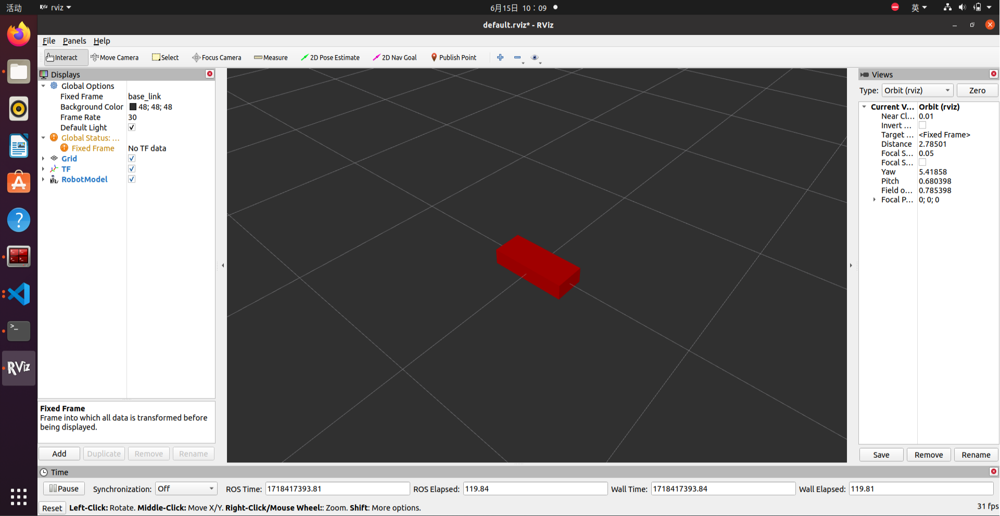
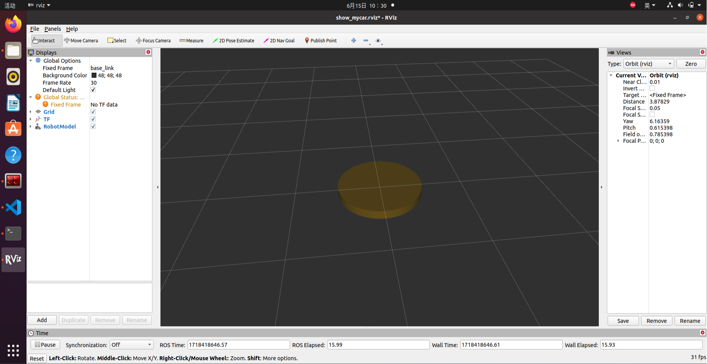
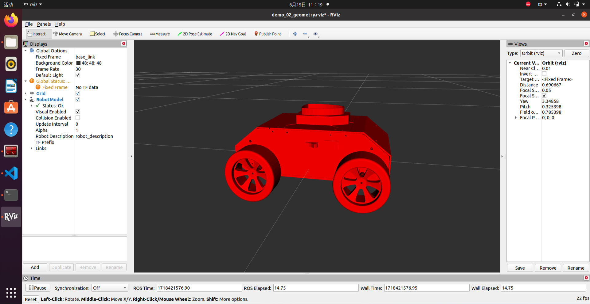
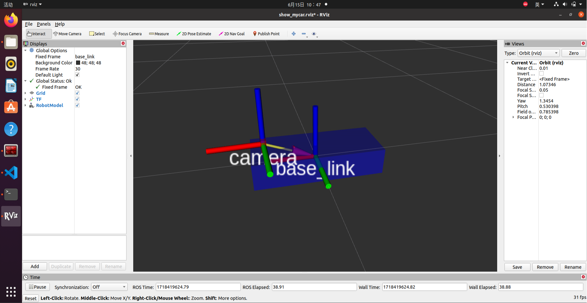
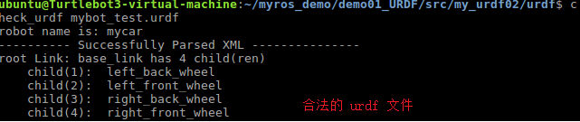
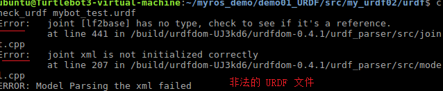
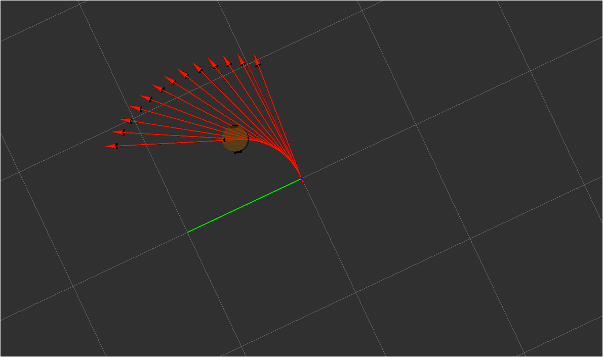
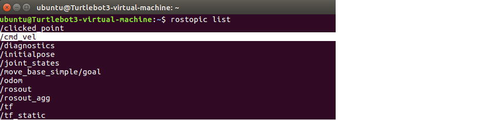

# 6.1 概述

机器人操作系统学习、开发与测试过程中，会遇到诸多问题，比如:

> 场景1:机器人一般价格不菲，学习ROS要购买一台机器人吗？
>
> 场景2:机器人与之交互的外界环境具有多样性，如何实现复杂的环境设计？
>
> 场景3:测试时，直接将未经验证的程序部署到实体机器人运行，安全吗？

在诸如此类的场景中，ROS中的**仿真**就显得尤为重要了。

------

## 1 概念

**机器人系统仿真：**是通过计算机对实体机器人系统进行模拟的技术，在 ROS 中，仿真实现涉及的内容主要有三:对机器人建模(**URDF**)、创建仿真环境(**Gazebo**)以及感知环境(**Rviz**)等系统性实现。

## 2 作用

**1. 仿真优势**

仿真在机器人系统研发过程中占有举足轻重的地位，在研发与测试中较之于实体机器人实现，仿真有如下几点的显著优势:

1. **低成本:** 当前机器人成本居高不下，动辄几十万，仿真可以大大降低成本，减小风险

2. **高效:** 搭建的环境更为多样且灵活，可以提高测试效率以及测试覆盖率

3. **高安全性:** 仿真环境下，无需考虑耗损问题

**2. 仿真缺陷**

机器人在仿真环境与实际环境下的表现差异较大，换言之，仿真并不能完全做到模拟真实的物理世界，存在一些"失真"的情况，原因:

1. 仿真器所使用的物理引擎目前还不能够完全精确模拟真实世界的物理情况

2. 仿真器构建的是关节驱动器（电机&齿轮箱）、传感器与信号通信的绝对理想情况，目前不支持模拟实际硬件缺陷或者一些临界状态等情形

## 3 相关组件

### 3.1 URDF

**URDF**是 Unified Robot Description Format 的首字母缩写，直译为**统一(标准化)机器人描述格式**，可以以一种 XML 的方式描述机器人的部分结构，比如底盘、摄像头、激光雷达、机械臂以及不同关节的自由度.....,该文件可以被 C++ 内置的解释器转换成可视化的机器人模型，是 ROS 中实现机器人仿真的重要组件

### 3.2 rviz

RViz 是 ROS Visualization Tool 的首字母缩写，直译为**ROS的三维可视化工具**。它的主要目的是以三维方式显示ROS消息，可以将 数据进行可视化表达。例如:可以显示机器人模型，可以无需编程就能表达激光测距仪（LRF）传感器中的传感 器到障碍物的距离，RealSense、Kinect或Xtion等三维距离传感器的点云数据（PCD， Point Cloud Data），从相机获取的图像值等

以“ros- [ROS_DISTRO] -desktop-full”命令安装ROS时，RViz会默认被安装。

运行使用命令`rviz`或`rosrun rviz rviz`

***如果rviz没有安装，请调用如下命令自行安装:***

```powershell
sudo apt install ros-[ROS_DISTRO]-rviz
```

### 3.3 gazebo

Gazebo是一款3D动态模拟器，用于显示机器人模型并创建仿真环境,能够在复杂的室内和室外环境中准确有效地模拟机器人。与游戏引擎提供高保真度的视觉模拟类似，Gazebo提供高保真度的物理模拟，其提供一整套传感器模型，以及对用户和程序非常友好的交互方式。

以“ros- [ROS_DISTRO] -desktop-full”命令安装ROS时，gzebo会默认被安装。

运行使用命令`gazebo`或`rosrun gazebo_ros gazebo`

**注意1:*****在 Ubuntu20.04 与 ROS Noetic 环境下，gazebo 启动异常以及解决***

- **问题1: **VMware: vmw_ioctl_command error Invalid argument(无效的参数)

  **解决:**

  `echo "export SVGA_VGPU10=0" >> ~/.bashrc`

  `source .bashrc`

- **问题2:** [Err] [REST.cc:205] Error in REST request

  **解决:**`sudo gedit ~/.ignition/fuel/config.yaml`

  然后将`url : https://api.ignitionfuel.org`使用 # 注释

  再添加`url: https://api.ignitionrobotics.org`

- **问题3:** 启动时抛出异常:`[gazebo-2] process has died [pid xxx, exit code 255, cmd.....`

  **解决:** `killall gzserver`和`killall gzclient`

**注意2:**如果 gazebo没有安装，请自行安装:

1.添加源:

```powershell
sudo sh -c 'echo "deb http://packages.osrfoundation.org/gazebo/ubuntu-stable `lsb_release -cs` main" 
>
 /etc/apt/sources.list.d/gazebo-stable.list'

wget http://packages.osrfoundation.org/gazebo.key -O - | sudo apt-key add -

```

2.安装：

```powershell
sudo apt update
sudo apt install gazebo11 
sudo apt install libgazebo11-dev
```

# 6.2 URDF集成Rviz基本流程

前面介绍过，URDF 不能单独使用，需要结合 Rviz 或 Gazebo，URDF 只是一个文件，需要在 Rviz 或 Gazebo 中渲染成图形化的机器人模型，当前，首先演示URDF与Rviz的集成使用，因为URDF与Rviz的集成较之于URDF与Gazebo的集成更为简单，后期，基于Rviz的集成实现，我们再进一步介绍URDF语法。

**需求描述:**

在 Rviz 中显示一个盒状机器人

**结果演示:**



**实现流程：**

1. 准备: 新建功能包，导入依赖
2. 核心: 编写 urdf 文件
3. 核心: 在 launch 文件集成 URDF 与 Rviz
4. 在 Rviz 中显示机器人模型

## 1. 创建功能包，导入依赖

创建一个新的功能包，名称自定义，导入依赖包:`urdf`与`xacro`

在当前功能包下，再新建几个目录:

`urdf`: 存储 urdf 文件的目录

`meshes`:机器人模型渲染文件(暂不使用)

`config`: 配置文件

`launch`: 存储 launch 启动文件

## 2. 编写 URDF 文件

新建一个子级文件夹:`urdf`(可选，用于存放urdf文件；同时也可新建一个xacro文件夹，用于存放xacro的文件)，文件夹中添加一个`.urdf`文件,复制如下内容:

```xml
<robot name="mycar">
    <link name="base_link">
        <visual>
            <geometry>
                <box size="0.5 0.2 0.1" />
            </geometry>
        </visual>
    </link>
</robot>
```

## 3. 在 launch 文件中集成 URDF 与 Rviz

在`launch`目录下，新建一个 launch 文件，该 launch 文件需要启动 Rviz，并导入 urdf 文件，Rviz 启动后可以自动载入解析`urdf`文件，并显示机器人模型，核心问题:如何导入 urdf 文件? 在 ROS 中，可以将 urdf 文件的路径设置到参数服务器，使用的参数名是:`robot_description`,示例代码如下:

```xml
<launch>

    <!-- 设置参数 -->
    <param name="robot_description" textfile="$(find 包名)/urdf/urdf/urdf文件名.urdf" />
	<!-- $(find 包名)从功能包位置开始，即相对地址-->
    <!-- 启动 rviz -->
    <node pkg="rviz" type="rviz" name="rviz" />

</launch>
```

## 4. 在 Rviz 中显示机器人模型

rviz 启动后，会发现并没有盒装的机器人模型，这是因为默认情况下没有添加机器人显示组件，需要手动添加，添加方式如下:


设置完毕后，可以正常显示了

## 5. 优化 rviz 启动

重复启动`launch`文件时，Rviz 之前的组件配置信息不会自动保存，需要重复执行步骤4的操作，为了方便使用，可以使用如下方式优化:

首先，将当前配置保存进`config`目录


然后，`launch`文件中 Rviz 的启动配置添加参数:`args`,值设置为`-d 配置文件路径`

```xml
<launch>
    <param name="robot_description" textfile="$(find 包名)/urdf/urdf/urdf01_HelloWorld.urdf" />
    <node pkg="rviz" type="rviz" name="rviz" args="-d $(find 报名)/config/rviz/配置名.rviz" />
</launch>
```

再启动时，就可以包含之前的组件配置了，使用更方便快捷。

# 6.3 URDF语法详解

URDF 文件是一个标准的 XML 文件，在 ROS 中预定义了一系列的标签用于描述机器人模型，机器人模型可能较为复杂，但是 ROS 的 URDF 中机器人的组成却是较为简单，可以主要简化为两部分:连杆(link标签) 与 关节(joint标签)，接下来我们就通过案例了解一下 URDF 中的不同标签:

- robot 根标签，类似于 launch文件中的launch标签
- link 连杆标签
- joint 关节标签
- gazebo 集成gazebo需要使用的标签

关于gazebo标签，后期在使用 gazebo 仿真时，才需要使用到，用于配置仿真环境所需参数，比如: 机器人材料属性、gazebo插件等，但是该标签不是机器人模型必须的，只有在仿真时才需设置

## 6.3.1 URDF语法详解01_robot

**robot**

urdf 中为了保证 xml 语法的完整性，使用了`robot`标签作为根标签，所有的 link 和 joint 以及其他标签都必须包含在 robot 标签内,在该标签内可以通过 name 属性设置机器人模型的名称

**1.属性**

name: 指定机器人模型的名称

**2.子标签**

其他标签都是子级标签

## 6.3.2 URDF语法详解02_link

**link**

urdf 中的 link 标签用于描述机器人某个部件(也即刚体部分)的外观和物理属性，比如: 机器人底座、轮子、激光雷达、摄像头...每一个部件都对应一个 link, 在 link 标签内，可以设计该部件的形状、尺寸、颜色、惯性矩阵、碰撞参数等一系列属性


**1.属性**

- name ---> 为连杆命名

**2.子标签**

- visual ---> 描述外观(对应的数据是可视的)
  - geometry 设置连杆的形状
    - 标签1: box(盒状)
      - 属性:size=长(x) 宽(y) 高(z)
    - 标签2: cylinder(圆柱)
      - 属性:radius=半径 length=高度
    - 标签3: sphere(球体)
      - 属性:radius=半径
    - 标签4: mesh(为连杆添加皮肤)
      - 属性: filename=资源路径(格式:**package://<packagename>/<path>/文件**)
  - origin 设置偏移量与倾斜弧度
    - 属性1: xyz=x偏移 y便宜 z偏移
    - 属性2: rpy=x翻滚 y俯仰 z偏航 (单位是弧度)
  - metrial 设置材料属性(颜色)
    - 属性: name
    - 标签: color
      - 属性: rgba=红绿蓝权重值与透明度 (每个权重值以及透明度取值[0,1])
- collision ---> 连杆的碰撞属性
- Inertial ---> 连杆的惯性矩阵

在此，只演示`visual`使用。

**3.案例**

**需求:**分别生成长方体、圆柱与球体的机器人部件

```xml
<robot name="geometry">
    <link name="base_link">
        <visual>
            <!-- 形状 -->
            <geometry>
                <!-- 长方体的长宽高 -->
                <!-- <box size="0.5 0.3 0.1" /> -->
                <!-- 圆柱，半径和长度 -->
                <!-- <cylinder radius="0.5" length="0.1" /> -->
                <!-- 球体，半径-->
                <!-- <sphere radius="0.3" /> -->
                <!-- 皮肤 -->
                <mesh filename="package://simulate_01/meshes/autolabor_mini.stl"/>
            </geometry>
            <!-- xyz坐标 rpy翻滚俯仰与偏航角度(3.14=180度 1.57=90度) -->
            <origin xyz="0 0 0" rpy="1.57 0 0" />
            <!-- 颜色: r=red g=green b=blue a=alpha -->
            <material name="black">
                <color rgba="1 0 0 1" />
            </material>
        </visual>
    </link>
</robot>
```

```XML
<launch>
    <param name="robot_description" textfile="$(find simulate_01)/urdf/urdf/demo_02_geometry.urdf" />
    <node pkg="rviz" type="rviz" name="rviz" args="-d $(find simulate_01)/config/demo_02_geometry.rviz" />
</launch>
```






## 6.3.3 URDF语法详解03_joint

**joint**

urdf 中的 joint 标签用于描述机器人关节的运动学和动力学属性，还可以指定关节运动的安全极限，机器人的两个部件(分别称之为 parent link 与 child link)以"关节"的形式相连接，不同的关节有不同的运动形式: 旋转、滑动、固定、旋转速度、旋转角度限制....,比如:安装在底座上的轮子可以360度旋转，而摄像头则可能是完全固定在底座上。

joint标签对应的数据在模型中是不可见的!


### 1.属性

- name ---> 为关节命名
- type ---> 关节运动形式
  - continuous: 旋转关节，可以绕单轴无限旋转
  - revolute: 旋转关节，类似于 continues,但是有旋转角度限制
  - prismatic: 滑动关节，沿某一轴线移动的关节，有位置极限
  - planer: 平面关节，允许在平面正交方向上平移或旋转
  - floating: 浮动关节，允许进行平移、旋转运动
  - fixed: 固定关节，不允许运动的特殊关节

### 2.子标签

- parent(必需的)

  parent link的名字是一个强制的属性：

  - link:父级连杆的名字，是这个link在机器人结构树中的名字。

- child(必需的)

  child link的名字是一个强制的属性：

  - link:子级连杆的名字，是这个link在机器人结构树中的名字。

- origin

  - 属性: xyz=各轴线上的偏移量 rpy=各轴线上的偏移弧度。

- axis

  - 属性: xyz用于设置围绕哪个关节轴运动。

### 3.案例

**需求：**创建机器人模型，底盘为长方体，在长方体的前面添加一摄像头，摄像头可以沿着 Z 轴 360 度旋转。



**URDF文件示例如下:**

```xml
<!-- 
    需求: 创建机器人模型，底盘为长方体，
         在长方体的前面添加一摄像头，
         摄像头可以沿着 Z 轴 360 度旋转

 -->
<robot name="mycar">
    <!-- 底盘 -->
    <link name="base_link">
        <visual>
            <geometry>
                <box size="0.5 0.2 0.1" />
            </geometry>
            <origin xyz="0 0 0" rpy="0 0 0" />
            <material name="blue">
                <color rgba="0 0 1.0 0.5" />
            </material>
        </visual>
    </link>

    <!-- 摄像头 -->
    <link name="camera">
        <visual>
            <geometry>
                <box size="0.02 0.05 0.05" />
            </geometry>
            <origin xyz="0 0 0" rpy="0 0 0" />
            <material name="red">
                <color rgba="1 0 0 0.5" />
            </material>
        </visual>
    </link>

    <!-- 关节 -->
    <joint name="camera2baselink" type="continuous">
        <parent link="base_link"/>
        <child link="camera" />
        <!-- 需要计算两个 link 的物理中心之间的偏移量 -->
        <origin xyz="0.2 0 0.075" rpy="0 0 0" />
        <axis xyz="0 0 1" />
    </joint>

</robot>
```

**launch文件示例如下:**

```xml
<launch>

    <param name="robot_description" textfile="$(find urdf_rviz_demo)/urdf/urdf/urdf03_joint.urdf" />
    <node pkg="rviz" type="rviz" name="rviz" args="-d $(find urdf_rviz_demo)/config/helloworld.rviz" /> 

    <!-- 添加关节状态发布节点 -->
    <node pkg="joint_state_publisher" type="joint_state_publisher" name="joint_state_publisher" />
    <!-- 添加机器人状态发布节点 -->
    <node pkg="robot_state_publisher" type="robot_state_publisher" name="robot_state_publisher" />
    <!-- 可选:用于控制关节运动的节点 -->
    <node pkg="joint_state_publisher_gui" type="joint_state_publisher_gui" name="joint_state_publisher_gui" />

</launch>
```

PS:

1.状态发布节点在此是必须的:

```xml
    <!-- 添加关节状态发布节点 -->
    <node pkg="joint_state_publisher" type="joint_state_publisher" name="joint_state_publisher" />
    <!-- 添加机器人状态发布节点 -->
    <node pkg="robot_state_publisher" type="robot_state_publisher" name="robot_state_publisher" />
```

2.关节运动控制节点(可选)，会生成关节控制的UI，用于测试关节运动是否正常。

```xml
    <!-- 可选:用于控制关节运动的节点 -->
    <node pkg="joint_state_publisher_gui" type="joint_state_publisher_gui" name="joint_state_publisher_gui" />
```

### 4.base_footpbrint优化urdf

前面实现的机器人模型是半沉到地下的，因为默认情况下: 底盘的中心点位于地图原点上，所以会导致这种情况产生，可以使用的优化策略，将初始 link 设置为一个尺寸极小的 link(比如半径为 0.001m 的球体，或边长为 0.001m 的立方体)，然后再在初始 link 上添加底盘等刚体，这样实现，虽然仍然存在初始link半沉的现象，但是基本可以忽略了。这个初始 link 一般称之为 base_footprint

```xml
<!--

    使用 base_footprint 优化

-->
<robot name="mycar">
    <!-- 设置一个原点(机器人中心点的投影) -->
    <link name="base_footprint">
        <visual>
            <geometry>
                <sphere radius="0.001" />
            </geometry>
        </visual>
    </link>

    <!-- 添加底盘 -->
    <link name="base_link">
        <visual>
            <geometry>
                <box size="0.5 0.2 0.1" />
            </geometry>
            <origin xyz="0 0 0" rpy="0 0 0" />
            <material name="blue">
                <color rgba="0 0 1.0 0.5" />
            </material>
        </visual>
    </link>

    <!-- 底盘与原点连接的关节 -->
    <joint name="base_link2base_footprint" type="fixed">
        <parent link="base_footprint" />
        <child link="base_link" />
        <origin xyz="0 0 0.05" />
    </joint>

    <!-- 添加摄像头 -->
    <link name="camera">
        <visual>
            <geometry>
                <box size="0.02 0.05 0.05" />
            </geometry>
            <origin xyz="0 0 0" rpy="0 0 0" />
            <material name="red">
                <color rgba="1 0 0 0.5" />
            </material>
        </visual>
    </link>
    <!-- 关节 -->
    <joint name="camera2baselink" type="continuous">
        <parent link="base_link"/>
        <child link="camera" />
        <origin xyz="0.2 0 0.075" rpy="0 0 0" />
        <axis xyz="0 0 1" />
    </joint>

</robot>
```

launch 文件内容不变。

### 5.遇到问题以及解决

**问题1:**

命令行输出如下错误提示

```powershell
UnicodeEncodeError: 'ascii' codec can't encode characters in position 463-464: ordinal not in range(128)
[joint_state_publisher-3] process has died [pid 4443, exit code 1, cmd /opt/ros/melodic/lib/joint_state_publisher/joint_state_publisher __name:=joint_state_publisher __log:=/home/rosmelodic/.ros/log/b38967c0-0acb-11eb-aee3-0800278ee10c/joint_state_publisher-3.log].
log file: /home/rosmelodic/.ros/log/b38967c0-0acb-11eb-aee3-0800278ee10c/joint_state_publisher-3*.log
```

rviz中提示坐标变换异常，导致机器人部件显示结构异常

**原因:**编码问题导致的

**解决:**去除URDF中的中文注释

**问题2:**[ERROR] [1584370263.037038]: Could not find the GUI, install the 'joint_state_publisher_gui' package

**解决:`sudo apt install ros-noetic-joint-state-publisher-gui`**

## 6.3.4 URDF练习——四轮小车

**需求描述:**

创建一个四轮圆柱状机器人模型，机器人参数如下,底盘为圆柱状，半径 10cm，高 8cm，四轮由两个驱动轮和两个万向支撑轮组成，两个驱动轮半径为 3.25cm,轮胎宽度1.5cm，两个万向轮为球状，半径 0.75cm，底盘离地间距为 1.5cm(与万向轮直径一致)

**结果演示:**


**实现流程:**

创建机器人模型可以分步骤实现

1. 新建 urdf 文件，并与 launch 文件集成
2. 搭建底盘
3. 在底盘上添加两个驱动轮
4. 在底盘上添加两个万向轮

### 1.新建urdf以及launch文件

urdf 文件:基本实现

```xml
<robot name="mycar">
    <!-- 设置 base_footprint  -->
    <link name="base_footprint">
        <visual>
            <geometry>
                <sphere radius="0.001" />
            </geometry>
        </visual>
    </link>

    <!-- 添加底盘 -->


    <!-- 添加驱动轮 -->


    <!-- 添加万向轮(支撑轮) -->

</robot>
```

launch 文件:

```xml
<launch>
    <!-- 将 urdf 文件内容设置进参数服务器 -->
    <param name="robot_description" textfile="$(find demo01_urdf_helloworld)/urdf/urdf/test.urdf" />

    <!-- 启动 rivz -->
    <node pkg="rviz" type="rviz" name="rviz_test" args="-d $(find demo01_urdf_helloworld)/config/helloworld.rviz" />

    <!-- 启动机器人状态和关节状态发布节点 -->
    <node pkg="robot_state_publisher" type="robot_state_publisher" name="robot_state_publisher" />
    <node pkg="joint_state_publisher" type="joint_state_publisher" name="joint_state_publisher" />

    <!-- 启动图形化的控制关节运动节点 -->
    <node pkg="joint_state_publisher_gui" type="joint_state_publisher_gui" name="joint_state_publisher_gui" />

</launch>
```

### 2.底盘搭建

```xml
<!-- 
        参数
            形状:圆柱 
            半径:10     cm 
            高度:8      cm 
            离地:1.5    cm

    -->
    <link name="base_link">
        <visual>
            <geometry>
                <cylinder radius="0.1" length="0.08" />
            </geometry>
            <origin xyz="0 0 0" rpy="0 0 0" />
            <material name="yellow">
                <color rgba="0.8 0.3 0.1 0.5" />
            </material>
        </visual>
    </link>

    <joint name="base_link2base_footprint" type="fixed">
        <parent link="base_footprint" />
        <child link="base_link"/>
        <origin xyz="0 0 0.055" />
    </joint>
```

### 3.添加驱动轮

```xml
<!-- 添加驱动轮 -->
    <!--
        驱动轮是侧翻的圆柱
        参数
            半径: 3.25 cm
            宽度: 1.5  cm
            颜色: 黑色
        关节设置:
            x = 0
            y = 底盘的半径 + 轮胎宽度 / 2
            z = 离地间距 + 底盘长度 / 2 - 轮胎半径 = 1.5 + 4 - 3.25 = 2.25(cm)
            axis = 0 1 0
    -->
    <link name="left_wheel">
        <visual>
            <geometry>
                <cylinder radius="0.0325" length="0.015" />
            </geometry>
            <origin xyz="0 0 0" rpy="1.5705 0 0" />
            <material name="black">
                <color rgba="0.0 0.0 0.0 1.0" />
            </material>
        </visual>

    </link>

    <joint name="left_wheel2base_link" type="continuous">
        <parent link="base_link" />
        <child link="left_wheel" />
        <origin xyz="0 0.1 -0.0225" />
        <axis xyz="0 1 0" />
    </joint>


    <link name="right_wheel">
        <visual>
            <geometry>
                <cylinder radius="0.0325" length="0.015" />
            </geometry>
            <origin xyz="0 0 0" rpy="1.5705 0 0" />
            <material name="black">
                <color rgba="0.0 0.0 0.0 1.0" />
            </material>
        </visual>

    </link>

    <joint name="right_wheel2base_link" type="continuous">
        <parent link="base_link" />
        <child link="right_wheel" />
        <origin xyz="0 -0.1 -0.0225" />
        <axis xyz="0 1 0" />
    </joint>
```

### 4.添加万向轮

```xml
<!-- 添加万向轮(支撑轮) -->
    <!--
        参数
            形状: 球体
            半径: 0.75 cm
            颜色: 黑色

        关节设置:
            x = 自定义(底盘半径 - 万向轮半径) = 0.1 - 0.0075 = 0.0925(cm)
            y = 0
            z = 底盘长度 / 2 + 离地间距 / 2 = 0.08 / 2 + 0.015 / 2 = 0.0475 
            axis= 1 1 1

    -->
    <link name="front_wheel">
        <visual>
            <geometry>
                <sphere radius="0.0075" />
            </geometry>
            <origin xyz="0 0 0" rpy="0 0 0" />
            <material name="black">
                <color rgba="0.0 0.0 0.0 1.0" />
            </material>
        </visual>
    </link>

    <joint name="front_wheel2base_link" type="continuous">
        <parent link="base_link" />
        <child link="front_wheel" />
        <origin xyz="0.0925 0 -0.0475" />
        <axis xyz="1 1 1" />
    </joint>

    <link name="back_wheel">
        <visual>
            <geometry>
                <sphere radius="0.0075" />
            </geometry>
            <origin xyz="0 0 0" rpy="0 0 0" />
            <material name="black">
                <color rgba="0.0 0.0 0.0 1.0" />
            </material>
        </visual>
    </link>

    <joint name="back_wheel2base_link" type="continuous">
        <parent link="base_link" />
        <child link="back_wheel" />
        <origin xyz="-0.0925 0 -0.0475" />
        <axis xyz="1 1 1" />
    </joint>
```

## 6.3.5 URDF工具

在 ROS 中，提供了一些工具来方便 URDF 文件的编写，比如:

- `check_urdf`命令可以检查复杂的 urdf 文件是否存在语法问题
- `urdf_to_graphiz`命令可以查看 urdf 模型结构，显示不同 link 的层级关系

当然，要使用工具之前，首先需要安装，安装命令:`sudo apt install liburdfdom-tools`

### 1.check_urdf 语法检查

进入urdf文件所属目录，调用:`check_urdf urdf文件`，如果不抛出异常，说明文件合法,否则非法





### 2.urdf_to_graphiz 结构查看

进入urdf文件所属目录，调用:`urdf_to_graphiz urdf文件`，当前目录下会生成 pdf 文件


# 6.4 URDF优化_xacro

前面 URDF 文件构建机器人模型的过程中，存在若干问题。

> 问题1:在设计关节的位置时，需要按照一定的公式计算，公式是固定的，但是在 URDF 中依赖于人工计算，存在不便，容易计算失误，且当某些参数发生改变时，还需要重新计算。
>
> 问题2:URDF 中的部分内容是高度重复的，驱动轮与支撑轮的设计实现，不同轮子只是部分参数不同，形状、颜色、翻转量都是一致的，在实际应用中，构建复杂的机器人模型时，更是易于出现高度重复的设计，按照一般的编程涉及到重复代码应该考虑封装。
>
> ......

如果在编程语言中，可以通过变量结合函数直接解决上述问题，在 ROS 中，已经给出了类似编程的优化方案，称之为:**Xacro**

------

**概念**

Xacro 是 XML Macros 的缩写，Xacro 是一种 XML 宏语言，是可编程的 XML。

**原理**

Xacro 可以声明变量，可以通过数学运算求解，使用流程控制控制执行顺序，还可以通过类似函数的实现，封装固定的逻辑，将逻辑中需要的可变的数据以参数的方式暴露出去，从而提高代码复用率以及程序的安全性。

**作用**

较之于纯粹的 URDF 实现，可以编写更安全、精简、易读性更强的机器人模型文件，且可以提高编写效率。

## 6.4.1 Xacro_快速体验

**目的:**简单了解 xacro 的基本语法。

**需求描述:**

使用xacro优化上一节案例中驱动轮实现，需要使用变量封装底盘的半径、高度，使用数学公式动态计算底盘的关节点坐标，使用 Xacro 宏封装轮子重复的代码并调用宏创建两个轮子(注意: 在此，演示 Xacro 的基本使用，不必要生成合法的 URDF )。

**准备:**

创建功能包，导入 urdf 与 xacro。

### 1.Xacro文件编写

编写 Xacro 文件，以变量的方式封装属性(常量半径、高度、车轮半径...)，以函数的方式封装重复实现(车轮的添加)。

```xml
<robot name="mycar" xmlns:xacro="http://wiki.ros.org/xacro">
    <!-- 属性封装 -->
    <xacro:property name="wheel_radius" value="0.0325" />
    <xacro:property name="wheel_length" value="0.0015" />
    <xacro:property name="PI" value="3.1415927" />
    <xacro:property name="base_link_length" value="0.08" />
    <xacro:property name="lidi_space" value="0.015" />

    <!-- 宏 -->
    <xacro:macro name="wheel_func" params="wheel_name flag" >
        <link name="${wheel_name}_wheel">
            <visual>
                <geometry>
                    <cylinder radius="${wheel_radius}" length="${wheel_length}" />
                </geometry>

                <origin xyz="0 0 0" rpy="${PI / 2} 0 0" />

                <material name="wheel_color">
                    <color rgba="0 0 0 0.3" />
                </material>
            </visual>
        </link>

        <!-- 3-2.joint -->
        <joint name="${wheel_name}2link" type="continuous">
            <parent link="base_link"  />
            <child link="${wheel_name}_wheel" />
            <!-- 
                x 无偏移
                y 车体半径
                z z= 车体高度 / 2 + 离地间距 - 车轮半径

            -->
            <origin xyz="0 ${0.1 * flag} ${(base_link_length / 2 + lidi_space - wheel_radius) * -1}" rpy="0 0 0" />
            <axis xyz="0 1 0" />
        </joint>

    </xacro:macro>
    <xacro:wheel_func wheel_name="left" flag="1" />
    <xacro:wheel_func wheel_name="right" flag="-1" />
</robot>
```

### 2.Xacro文件转换成 urdf 文件

命令行进入 xacro文件 所属目录，执行:`rosrun xacro xacro xxx.xacro > xxx.urdf`, 会将 xacro 文件解析为 urdf 文件，内容如下:

```xml
<?xml version="1.0" ?>
<!-- =================================================================================== -->
<!-- |    This document was autogenerated by xacro from test.xacro                     | -->
<!-- |    EDITING THIS FILE BY HAND IS NOT RECOMMENDED                                 | -->
<!-- =================================================================================== -->
<robot name="mycar">
  <link name="left_wheel">
    <visual>
      <geometry>
        <cylinder length="0.0015" radius="0.0325"/>
      </geometry>
      <origin rpy="1.57079635 0 0" xyz="0 0 0"/>
      <material name="wheel_color">
        <color rgba="0 0 0 0.3"/>
      </material>
    </visual>
  </link>
  <!-- 3-2.joint -->
  <joint name="left2link" type="continuous">
    <parent link="base_link"/>
    <child link="left_wheel"/>
    <!-- 
                x 无偏移
                y 车体半径
                z z= 车体高度 / 2 + 离地间距 - 车轮半径

            -->
    <origin rpy="0 0 0" xyz="0 0.1 -0.0225"/>
    <axis xyz="0 1 0"/>
  </joint>
  <link name="right_wheel">
    <visual>
      <geometry>
        <cylinder length="0.0015" radius="0.0325"/>
      </geometry>
      <origin rpy="1.57079635 0 0" xyz="0 0 0"/>
      <material name="wheel_color">
        <color rgba="0 0 0 0.3"/>
      </material>
    </visual>
  </link>
  <!-- 3-2.joint -->
  <joint name="right2link" type="continuous">
    <parent link="base_link"/>
    <child link="right_wheel"/>
    <!-- 
                x 无偏移
                y 车体半径
                z z= 车体高度 / 2 + 离地间距 - 车轮半径

            -->
    <origin rpy="0 0 0" xyz="0 -0.1 -0.0225"/>
    <axis xyz="0 1 0"/>
  </joint>
</robot>
```

注意: 该案例编写生成的是非法的 URDF 文件，目的在于演示 Xacro 的极简使用以及优点。

## 6.4.2 Xacro_语法详解

xacro 提供了可编程接口，类似于计算机语言，包括变量声明调用、函数声明与调用等语法实现。在使用 xacro 生成 urdf 时，根标签`robot`中必须包含命名空间声明:`xmlns:xacro="http://wiki.ros.org/xacro"`

**1. 属性与算数运算**

用于封装 URDF 中的一些字段，比如: PAI 值，小车的尺寸，轮子半径 ....

**属性定义**

```xml
<xacro:property name="xxxx" value="yyyy" />
```

**属性调用**

```
${属性名称}
```

**算数运算**

```
${数学表达式}
```

**2. 宏**

类似于函数实现，提高代码复用率，优化代码结构，提高安全性

**宏定义**

```xml
<xacro:macro name="宏名称" params="参数列表(多参数之间使用空格分隔)">

    .....

    参数调用格式: ${参数名}

</xacro:macro>
```

**宏调用**

```xml
<xacro:宏名称 参数1=xxx 参数2=xxx/>
```

**3. 文件包含**

机器人由多部件组成，不同部件可能封装为单独的 xacro 文件，最后再将不同的文件集成，组合为完整机器人，可以使用文件包含实现

**文件包含**

```xml
<robot name="xxx" xmlns:xacro="http://wiki.ros.org/xacro">
      <xacro:include filename="my_base.xacro" />
      <xacro:include filename="my_camera.xacro" />
      <xacro:include filename="my_laser.xacro" />
      ....
</robot>
```

## 6.4.3 Xacro_完整使用流程示例

**需求描述:**

使用 Xacro 优化 URDF 版的小车底盘模型实现

**结果演示:**

.png)

### 1.编写 Xacro 文件

```xml
<!--
    使用 xacro 优化 URDF 版的小车底盘实现：

    实现思路:
    1.将一些常量、变量封装为 xacro:property
      比如:PI 值、小车底盘半径、离地间距、车轮半径、宽度 ....
    2.使用 宏 封装驱动轮以及支撑轮实现，调用相关宏生成驱动轮与支撑轮

-->
<!-- 根标签，必须声明 xmlns:xacro -->
<robot name="my_base" xmlns:xacro="http://www.ros.org/wiki/xacro">
    <!-- 封装变量、常量 -->
    <xacro:property name="PI" value="3.141"/>
    <!-- 宏:黑色设置 -->
    <material name="black">
        <color rgba="0.0 0.0 0.0 1.0" />
    </material>
    <!-- 底盘属性 -->
    <xacro:property name="base_footprint_radius" value="0.001" /> <!-- base_footprint 半径  -->
    <xacro:property name="base_link_radius" value="0.1" /> <!-- base_link 半径 -->
    <xacro:property name="base_link_length" value="0.08" /> <!-- base_link 长 -->
    <xacro:property name="earth_space" value="0.015" /> <!-- 离地间距 -->

    <!-- 底盘 -->
    <link name="base_footprint">
      <visual>
        <geometry>
          <sphere radius="${base_footprint_radius}" />
        </geometry>
      </visual>
    </link>

    <link name="base_link">
      <visual>
        <geometry>
          <cylinder radius="${base_link_radius}" length="${base_link_length}" />
        </geometry>
        <origin xyz="0 0 0" rpy="0 0 0" />
        <material name="yellow">
          <color rgba="0.5 0.3 0.0 0.5" />
        </material>
      </visual>
    </link>

    <joint name="base_link2base_footprint" type="fixed">
      <parent link="base_footprint" />
      <child link="base_link" />
      <origin xyz="0 0 ${earth_space + base_link_length / 2 }" />
    </joint>

    <!-- 驱动轮 -->
    <!-- 驱动轮属性 -->
    <xacro:property name="wheel_radius" value="0.0325" /><!-- 半径 -->
    <xacro:property name="wheel_length" value="0.015" /><!-- 宽度 -->
    <!-- 驱动轮宏实现 -->
    <xacro:macro name="add_wheels" params="name flag">
      <link name="${name}_wheel">
        <visual>
          <geometry>
            <cylinder radius="${wheel_radius}" length="${wheel_length}" />
          </geometry>
          <origin xyz="0.0 0.0 0.0" rpy="${PI / 2} 0.0 0.0" />
          <material name="black" />
        </visual>
      </link>

      <joint name="${name}_wheel2base_link" type="continuous">
        <parent link="base_link" />
        <child link="${name}_wheel" />
        <origin xyz="0 ${flag * base_link_radius} ${-(earth_space + base_link_length / 2 - wheel_radius) }" />
        <axis xyz="0 1 0" />
      </joint>
    </xacro:macro>
    <xacro:add_wheels name="left" flag="1" />
    <xacro:add_wheels name="right" flag="-1" />
    <!-- 支撑轮 -->
    <!-- 支撑轮属性 -->
    <xacro:property name="support_wheel_radius" value="0.0075" /> <!-- 支撑轮半径 -->

    <!-- 支撑轮宏 -->
    <xacro:macro name="add_support_wheel" params="name flag" >
      <link name="${name}_wheel">
        <visual>
            <geometry>
                <sphere radius="${support_wheel_radius}" />
            </geometry>
            <origin xyz="0 0 0" rpy="0 0 0" />
            <material name="black" />
        </visual>
      </link>

      <joint name="${name}_wheel2base_link" type="continuous">
          <parent link="base_link" />
          <child link="${name}_wheel" />
          <origin xyz="${flag * (base_link_radius - support_wheel_radius)} 0 ${-(base_link_length / 2 + earth_space / 2)}" />
          <axis xyz="1 1 1" />
      </joint>
    </xacro:macro>

    <xacro:add_support_wheel name="front" flag="1" />
    <xacro:add_support_wheel name="back" flag="-1" />

</robot>
```

### 2.集成launch文件

**方式1:**先将 xacro 文件转换出 urdf 文件，然后集成

先将 xacro 文件解析成 urdf 文件:`rosrun xacro xacro xxx.xacro > xxx.urdf`然后再按照之前的集成方式直接整合 launch 文件,内容示例:

```xml
<launch>
    <param name="robot_description" textfile="$(find demo01_urdf_helloworld)/urdf/xacro/my_base.urdf" />

    <node pkg="rviz" type="rviz" name="rviz" args="-d $(find demo01_urdf_helloworld)/config/helloworld.rviz" />
    <node pkg="joint_state_publisher" type="joint_state_publisher" name="joint_state_publisher" output="screen" />
    <node pkg="robot_state_publisher" type="robot_state_publisher" name="robot_state_publisher" output="screen" />
    <node pkg="joint_state_publisher_gui" type="joint_state_publisher_gui" name="joint_state_publisher_gui" output="screen" />

</launch>
```

**方式2:**在 launch 文件中直接加载 xacro(**建议使用**)

launch 内容示例:

```xml
<launch>
    <param name="robot_description" command="$(find xacro)/xacro $(find demo01_urdf_helloworld)/urdf/xacro/my_base.urdf.xacro" />

    <node pkg="rviz" type="rviz" name="rviz" args="-d $(find demo01_urdf_helloworld)/config/helloworld.rviz" />
    <node pkg="joint_state_publisher" type="joint_state_publisher" name="joint_state_publisher" output="screen" />
    <node pkg="robot_state_publisher" type="robot_state_publisher" name="robot_state_publisher" output="screen" />
    <node pkg="joint_state_publisher_gui" type="joint_state_publisher_gui" name="joint_state_publisher_gui" output="screen" />

</launch>
```

核心代码:

```xml
<param name="robot_description" command="$(find xacro)/xacro $(find demo01_urdf_helloworld)/urdf/xacro/my_base.urdf.xacro" />
```

加载`robot_description`时使用`command`属性，属性值就是调用 xacro 功能包的 xacro 程序直接解析 xacro 文件。

## 6.4.4 Xacro_实操

**需求描述:**

在前面小车底盘基础之上，添加摄像头和雷达传感器。

**结果演示:**


**实现分析:**

机器人模型由多部件组成，可以将不同组件设置进单独文件，最终通过文件包含实现组件的拼装。

**实现流程:**

1. 首先编写摄像头和雷达的 xacro 文件
2. 然后再编写一个组合文件，组合底盘、摄像头与雷达
3. 最后，通过 launch 文件启动 Rviz 并显示模型

### 1.摄像头和雷达 Xacro 文件实现

摄像头 xacro 文件:

```xml
<!-- 摄像头相关的 xacro 文件 -->
<robot name="my_camera" xmlns:xacro="http://wiki.ros.org/xacro">
    <!-- 摄像头属性 -->
    <xacro:property name="camera_length" value="0.01" /> <!-- 摄像头长度(x) -->
    <xacro:property name="camera_width" value="0.025" /> <!-- 摄像头宽度(y) -->
    <xacro:property name="camera_height" value="0.025" /> <!-- 摄像头高度(z) -->
    <xacro:property name="camera_x" value="0.08" /> <!-- 摄像头安装的x坐标 -->
    <xacro:property name="camera_y" value="0.0" /> <!-- 摄像头安装的y坐标 -->
    <xacro:property name="camera_z" value="${base_link_length / 2 + camera_height / 2}" /> <!-- 摄像头安装的z坐标:底盘高度 / 2 + 摄像头高度 / 2  -->

    <!-- 摄像头关节以及link -->
    <link name="camera">
        <visual>
            <geometry>
                <box size="${camera_length} ${camera_width} ${camera_height}" />
            </geometry>
            <origin xyz="0.0 0.0 0.0" rpy="0.0 0.0 0.0" />
            <material name="black" />
        </visual>
    </link>

    <joint name="camera2base_link" type="fixed">
        <parent link="base_link" />
        <child link="camera" />
        <origin xyz="${camera_x} ${camera_y} ${camera_z}" />
    </joint>
</robot>
```

雷达 xacro 文件:

```xml
<!--
    小车底盘添加雷达
-->
<robot name="my_laser" xmlns:xacro="http://wiki.ros.org/xacro">

    <!-- 雷达支架 -->
    <xacro:property name="support_length" value="0.15" /> <!-- 支架长度 -->
    <xacro:property name="support_radius" value="0.01" /> <!-- 支架半径 -->
    <xacro:property name="support_x" value="0.0" /> <!-- 支架安装的x坐标 -->
    <xacro:property name="support_y" value="0.0" /> <!-- 支架安装的y坐标 -->
    <xacro:property name="support_z" value="${base_link_length / 2 + support_length / 2}" /> <!-- 支架安装的z坐标:底盘高度 / 2 + 支架高度 / 2  -->

    <link name="support">
        <visual>
            <geometry>
                <cylinder radius="${support_radius}" length="${support_length}" />
            </geometry>
            <origin xyz="0.0 0.0 0.0" rpy="0.0 0.0 0.0" />
            <material name="red">
                <color rgba="0.8 0.2 0.0 0.8" />
            </material>
        </visual>
    </link>

    <joint name="support2base_link" type="fixed">
        <parent link="base_link" />
        <child link="support" />
        <origin xyz="${support_x} ${support_y} ${support_z}" />
    </joint>


    <!-- 雷达属性 -->
    <xacro:property name="laser_length" value="0.05" /> <!-- 雷达长度 -->
    <xacro:property name="laser_radius" value="0.03" /> <!-- 雷达半径 -->
    <xacro:property name="laser_x" value="0.0" /> <!-- 雷达安装的x坐标 -->
    <xacro:property name="laser_y" value="0.0" /> <!-- 雷达安装的y坐标 -->
    <xacro:property name="laser_z" value="${support_length / 2 + laser_length / 2}" /> <!-- 雷达安装的z坐标:支架高度 / 2 + 雷达高度 / 2  -->

    <!-- 雷达关节以及link -->
    <link name="laser">
        <visual>
            <geometry>
                <cylinder radius="${laser_radius}" length="${laser_length}" />
            </geometry>
            <origin xyz="0.0 0.0 0.0" rpy="0.0 0.0 0.0" />
            <material name="black" />
        </visual>
    </link>

    <joint name="laser2support" type="fixed">
        <parent link="support" />
        <child link="laser" />
        <origin xyz="${laser_x} ${laser_y} ${laser_z}" />
    </joint>
</robot>
```

### 2.组合底盘摄像头与雷达的 xacro 文件

```xml
<!-- 组合小车底盘与摄像头与雷达 -->
<robot name="my_car_camera" xmlns:xacro="http://wiki.ros.org/xacro">
    <xacro:include filename="my_base.urdf.xacro" />
    <xacro:include filename="my_camera.urdf.xacro" />
    <xacro:include filename="my_laser.urdf.xacro" />
</robot>
```

### 3.launch 文件

```xml
<launch>
    <param name="robot_description" command="$(find xacro)/xacro $(find demo01_urdf_helloworld)/urdf/xacro/my_base_camera_laser.urdf.xacro" />

    <node pkg="rviz" type="rviz" name="rviz" args="-d $(find demo01_urdf_helloworld)/config/helloworld.rviz" />
    <node pkg="joint_state_publisher" type="joint_state_publisher" name="joint_state_publisher" output="screen" />
    <node pkg="robot_state_publisher" type="robot_state_publisher" name="robot_state_publisher" output="screen" />
    <node pkg="joint_state_publisher_gui" type="joint_state_publisher_gui" name="joint_state_publisher_gui" output="screen" />

</launch>
```

# 6.5 Rviz中控制机器人模型运动

通过 URDF 结合 rviz 可以创建并显示机器人模型，不过，当前实现的只是静态模型，如何控制模型的运动呢？在此，可以调用 Arbotix 实现此功能。

------

**简介**

**Arbotix:**Arbotix 是一款控制电机、舵机的控制板，**并提供相应的 ros 功能包**，这个功能包的功能不仅可以驱动真实的 Arbotix 控制板，它还提供一个差速控制器，通过接受速度控制指令更新机器人的 joint 状态，从而帮助我们实现机器人在 rviz 中的运动。

这个差速控制器在 arbotix_python 程序包中，完整的 arbotix 程序包还包括多种控制器，分别对应 dynamixel 电机、多关节机械臂以及不同形状的夹持器。

接下来，通过一个案例演示 arbotix 的使用。

**需求描述:**

控制机器人模型在 rviz 中做圆周运动

**结果演示:**



**实现流程:**

1. 安装 Arbotix
2. 创建新功能包，准备机器人 urdf、xacro 文件
3. 添加 Arbotix 配置文件
4. 编写 launch 文件配置 Arbotix
5. 启动 launch 文件并控制机器人模型运动

### 1.安装 Arbotix

**方式1:**命令行调用

```
sudo apt-get install ros-<<VersionName()>>-arbotix
Copy
```

将 <<VsersionName()>> 替换成当前 ROS 版本名称，如果提示功能包无法定位，请采用方式2。

**方式2:**源码安装

先从 github 下载源码，然后调用 catkin_make 编译

```
git clone https://github.com/vanadiumlabs/arbotix_ros.git
Copy
```

### 2.创建新功能包，准备机器人 urdf、xacro

urdf 和 xacro 调用上一讲实现即可

### 3.添加 arbotix 所需的配置文件

**添加 arbotix 所需配置文件**

```yaml
# 该文件是控制器配置,一个机器人模型可能有多个控制器，比如: 底盘、机械臂、夹持器(机械手)....
# 因此，根 name 是 controller
controllers: {
   # 单控制器设置
   base_controller: {
          #类型: 差速控制器
       type: diff_controller,
       #参考坐标
       base_frame_id: base_footprint, 
       #两个轮子之间的间距
       base_width: 0.2,
       #控制频率
       ticks_meter: 2000, 
       #PID控制参数，使机器人车轮快速达到预期速度
       Kp: 12, 
       Kd: 12, 
       Ki: 0, 
       Ko: 50, 
       #加速限制
       accel_limit: 1.0 
    }
}
Copy
```

**另请参考:** http://wiki.ros.org/arbotix_python/diff_controller

### 4.launch 文件中配置 arbotix 节点

**launch 示例代码**

```xml
<node name="arbotix" pkg="arbotix_python" type="arbotix_driver" output="screen">
     <rosparam file="$(find my_urdf05_rviz)/config/hello.yaml" command="load" />
     <param name="sim" value="true" />
</node>
Copy
```

代码解释:

<node> 调用了 arbotix_python 功能包下的 arbotix_driver 节点

<rosparam> arbotix 驱动机器人运行时，需要获取机器人信息，可以通过 file 加载配置文件

<param> 在仿真环境下，需要配置 sim 为 true

### 5.启动 launch 文件并控制机器人模型运动

**启动launch:**roslaunch xxxx ....launch

**配置 rviz:**


**控制小车运动:**

此时调用 rostopic list 会发现一个熟悉的话题: /cmd_vel



也就说我们可以发布 cmd_vel 话题消息控制小陈运动了，该实现策略有多种，可以另行编写节点，或者更简单些可以直接通过如下命令发布消息:

```
rostopic pub -r 10 /cmd_vel geometry_msgs/Twist '{linear: {x: 0.2, y: 0, z: 0}, angular: {x: 0, y: 0, z: 0.5}}'
Copy
```

现在，小车就可以运动起来了。

# 6.6 URDF集成Gazebo

URDF 需要集成进 Rviz 或 Gazebo 才能显示可视化的机器人模型，前面已经介绍了URDF 与 Rviz 的集成，本节主要介绍:

- URDF 与 Gazebo 的基本集成流程；
- 如果要在 Gazebo 中显示机器人模型，URDF 需要做的一些额外配置；
- 关于Gazebo仿真环境的搭建。

## 6.6.1 URDF与Gazebo基本集成流程

URDF 与 Gazebo 集成流程与 Rviz 实现类似，主要步骤如下:

1. 创建功能包，导入依赖项
2. 编写 URDF 或 Xacro 文件
3. 启动 Gazebo 并显示机器人模型

### 1.创建功能包

创建新功能包，导入依赖包: urdf、xacro、gazebo_ros、gazebo_ros_control、gazebo_plugins

### 2.编写URDF文件

```xml
<!-- 
    创建一个机器人模型(盒状即可)，显示在 Gazebo 中 
-->

<robot name="mycar">
    <link name="base_link">
        <visual>
            <geometry>
                <box size="0.5 0.2 0.1" />
            </geometry>
            <origin xyz="0.0 0.0 0.0" rpy="0.0 0.0 0.0" />
            <material name="yellow">
                <color rgba="0.5 0.3 0.0 1" />
            </material>
        </visual>
        <collision>
            <geometry>
                <box size="0.5 0.2 0.1" />
            </geometry>
            <origin xyz="0.0 0.0 0.0" rpy="0.0 0.0 0.0" />
        </collision>
        <inertial>
            <origin xyz="0 0 0" />
            <mass value="6" />
            <inertia ixx="1" ixy="0" ixz="0" iyy="1" iyz="0" izz="1" />
        </inertial>
    </link>
    <gazebo reference="base_link">
        <material>Gazebo/Black</material>
    </gazebo>

</robot>
```

注意， 当 URDF 需要与 Gazebo 集成时，和 Rviz 有明显区别:

1.必须使用 collision 标签，因为既然是仿真环境，那么必然涉及到碰撞检测，collision 提供碰撞检测的依据。

2.必须使用 inertial 标签，此标签标注了当前机器人某个刚体部分的惯性矩阵，用于一些力学相关的仿真计算。

3.颜色设置，也需要重新使用 gazebo 标签标注，因为之前的颜色设置为了方便调试包含透明度，仿真环境下没有此选项。

### 3.启动Gazebo并显示模型

launch 文件实现:

```xml
<launch>

    <!-- 将 Urdf 文件的内容加载到参数服务器 -->
    <param name="robot_description" textfile="$(find demo02_urdf_gazebo)/urdf/urdf01_helloworld.urdf" />

    <!-- 启动 gazebo -->
    <include file="$(find gazebo_ros)/launch/empty_world.launch" />

    <!-- 在 gazebo 中显示机器人模型 -->
    <node pkg="gazebo_ros" type="spawn_model" name="model" args="-urdf -model mycar -param robot_description"  />
</launch>
```

代码解释:

```xml
<include file="$(find gazebo_ros)/launch/empty_world.launch" />
<!-- 启动 Gazebo 的仿真环境，当前环境为空环境 -->
Copy
<node pkg="gazebo_ros" type="spawn_model" name="model" args="-urdf -model mycar -param robot_description"  />

<!-- 
    在 Gazebo 中加载一个机器人模型，该功能由 gazebo_ros 下的 spawn_model 提供:
    -urdf 加载的是 urdf 文件
    -model mycar 模型名称是 mycar
    -param robot_description 从参数 robot_description 中载入模型
    -x 模型载入的 x 坐标
    -y 模型载入的 y 坐标
    -z 模型载入的 z 坐标
-->
```

## 6.6.2 UR2DF集成Gazebo相关设置

较之于 rviz，gazebo在集成 URDF 时，需要做些许修改，比如:必须添加 collision 碰撞属性相关参数、必须添加 inertial 惯性矩阵相关参数，另外，如果直接移植 Rviz 中机器人的颜色设置是没有显示的，颜色设置也必须做相应的变更。

### 1.collision

如果机器人link是标准的几何体形状，和link的 visual 属性设置一致即可。

### 2.inertial

惯性矩阵的设置需要结合link的质量与外形参数动态生成，标准的球体、圆柱与立方体的惯性矩阵公式如下(已经封装为 xacro 实现):

球体惯性矩阵

```xml
<!-- Macro for inertia matrix -->
    <xacro:macro name="sphere_inertial_matrix" params="m r">
        <inertial>
            <mass value="${m}" />
            <inertia ixx="${2*m*r*r/5}" ixy="0" ixz="0"
                iyy="${2*m*r*r/5}" iyz="0" 
                izz="${2*m*r*r/5}" />
        </inertial>
    </xacro:macro>
```

圆柱惯性矩阵

```xml
<xacro:macro name="cylinder_inertial_matrix" params="m r h">
    <inertial>
        <mass value="${m}" />
        <inertia ixx="${m*(3*r*r+h*h)/12}" ixy = "0" ixz = "0"
            iyy="${m*(3*r*r+h*h)/12}" iyz = "0"
            izz="${m*r*r/2}" /> 
    </inertial>
</xacro:macro>
```

立方体惯性矩阵

```xml
<xacro:macro name="Box_inertial_matrix" params="m l w h">
    <inertial>
    	<mass value="${m}" />
        	<inertia ixx="${m*(h*h + l*l)/12}" ixy = "0" ixz = "0"
            	iyy="${m*(w*w + l*l)/12}" iyz= "0"
                izz="${m*(w*w + h*h)/12}" />
    </inertial>
</xacro:macro>
```

需要注意的是，原则上，除了 base_footprint 外，机器人的每个刚体部分都需要设置惯性矩阵，且惯性矩阵必须经计算得出，如果随意定义刚体部分的惯性矩阵，那么可能会导致机器人在 Gazebo 中出现抖动，移动等现象。

### 3.颜色设置

在 gazebo 中显示 link 的颜色，必须要使用指定的标签:

```xml
<gazebo reference="link节点名称">
     <material>Gazebo/Blue</material>
</gazebo>
Copy
```

**PS：**material 标签中，设置的值区分大小写，颜色可以设置为 Red Blue Green Black .....

## 6.6.3 URDF集成Gazebo实操

**需求描述:**

将之前的机器人模型(xacro版)显示在 gazebo 中

**结果演示:**


*实现流程:**

1. 需要编写封装惯性矩阵算法的 xacro 文件
2. 为机器人模型中的每一个 link 添加 collision 和 inertial 标签，并且重置颜色属性
3. 在 launch 文件中启动 gazebo 并添加机器人模型

### 1.编写封装惯性矩阵算法的 xacro 文件

```xml
<robot name="base" xmlns:xacro="http://wiki.ros.org/xacro">
    <!-- Macro for inertia matrix -->
    <xacro:macro name="sphere_inertial_matrix" params="m r">
        <inertial>
            <mass value="${m}" />
            <inertia ixx="${2*m*r*r/5}" ixy="0" ixz="0"
                iyy="${2*m*r*r/5}" iyz="0" 
                izz="${2*m*r*r/5}" />
        </inertial>
    </xacro:macro>

    <xacro:macro name="cylinder_inertial_matrix" params="m r h">
        <inertial>
            <mass value="${m}" />
            <inertia ixx="${m*(3*r*r+h*h)/12}" ixy = "0" ixz = "0"
                iyy="${m*(3*r*r+h*h)/12}" iyz = "0"
                izz="${m*r*r/2}" /> 
        </inertial>
    </xacro:macro>

    <xacro:macro name="Box_inertial_matrix" params="m l w h">
       <inertial>
               <mass value="${m}" />
               <inertia ixx="${m*(h*h + l*l)/12}" ixy = "0" ixz = "0"
                   iyy="${m*(w*w + l*l)/12}" iyz= "0"
                   izz="${m*(w*w + h*h)/12}" />
       </inertial>
   </xacro:macro>
</robot>
```

### 2.复制相关 xacro 文件，并设置 collision inertial 以及 color 等参数

#### **A.底盘 Xacro 文件**

```xml
<!--
    使用 xacro 优化 URDF 版的小车底盘实现：

    实现思路:
    1.将一些常量、变量封装为 xacro:property
      比如:PI 值、小车底盘半径、离地间距、车轮半径、宽度 ....
    2.使用 宏 封装驱动轮以及支撑轮实现，调用相关宏生成驱动轮与支撑轮

-->
<!-- 根标签，必须声明 xmlns:xacro -->
<robot name="my_base" xmlns:xacro="http://www.ros.org/wiki/xacro">
    <!-- 封装变量、常量 -->
    <!-- PI 值设置精度需要高一些，否则后续车轮翻转量计算时，可能会出现肉眼不能察觉的车轮倾斜，从而导致模型抖动 -->
    <xacro:property name="PI" value="3.1415926"/>
    <!-- 宏:黑色设置 -->
    <material name="black">
        <color rgba="0.0 0.0 0.0 1.0" />
    </material>
    <!-- 底盘属性 -->
    <xacro:property name="base_footprint_radius" value="0.001" /> <!-- base_footprint 半径  -->
    <xacro:property name="base_link_radius" value="0.1" /> <!-- base_link 半径 -->
    <xacro:property name="base_link_length" value="0.08" /> <!-- base_link 长 -->
    <xacro:property name="earth_space" value="0.015" /> <!-- 离地间距 -->
    <xacro:property name="base_link_m" value="0.5" /> <!-- 质量  -->

    <!-- 底盘 -->
    <link name="base_footprint">
      <visual>
        <geometry>
          <sphere radius="${base_footprint_radius}" />
        </geometry>
      </visual>
    </link>

    <link name="base_link">
      <visual>
        <geometry>
          <cylinder radius="${base_link_radius}" length="${base_link_length}" />
        </geometry>
        <origin xyz="0 0 0" rpy="0 0 0" />
        <material name="yellow">
          <color rgba="0.5 0.3 0.0 0.5" />
        </material>
      </visual>
      <collision>
        <geometry>
          <cylinder radius="${base_link_radius}" length="${base_link_length}" />
        </geometry>
        <origin xyz="0 0 0" rpy="0 0 0" />
      </collision>
      <xacro:cylinder_inertial_matrix m="${base_link_m}" r="${base_link_radius}" h="${base_link_length}" />

    </link>


    <joint name="base_link2base_footprint" type="fixed">
      <parent link="base_footprint" />
      <child link="base_link" />
      <origin xyz="0 0 ${earth_space + base_link_length / 2 }" />
    </joint>
    <gazebo reference="base_link">
        <material>Gazebo/Yellow</material>
    </gazebo>

    <!-- 驱动轮 -->
    <!-- 驱动轮属性 -->
    <xacro:property name="wheel_radius" value="0.0325" /><!-- 半径 -->
    <xacro:property name="wheel_length" value="0.015" /><!-- 宽度 -->
    <xacro:property name="wheel_m" value="0.05" /> <!-- 质量  -->

    <!-- 驱动轮宏实现 -->
    <xacro:macro name="add_wheels" params="name flag">
      <link name="${name}_wheel">
        <visual>
          <geometry>
            <cylinder radius="${wheel_radius}" length="${wheel_length}" />
          </geometry>
          <origin xyz="0.0 0.0 0.0" rpy="${PI / 2} 0.0 0.0" />
          <material name="black" />
        </visual>
        <collision>
          <geometry>
            <cylinder radius="${wheel_radius}" length="${wheel_length}" />
          </geometry>
          <origin xyz="0.0 0.0 0.0" rpy="${PI / 2} 0.0 0.0" />
        </collision>
        <xacro:cylinder_inertial_matrix m="${wheel_m}" r="${wheel_radius}" h="${wheel_length}" />

      </link>

      <joint name="${name}_wheel2base_link" type="continuous">
        <parent link="base_link" />
        <child link="${name}_wheel" />
        <origin xyz="0 ${flag * base_link_radius} ${-(earth_space + base_link_length / 2 - wheel_radius) }" />
        <axis xyz="0 1 0" />
      </joint>

      <gazebo reference="${name}_wheel">
        <material>Gazebo/Red</material>
      </gazebo>

    </xacro:macro>
    <xacro:add_wheels name="left" flag="1" />
    <xacro:add_wheels name="right" flag="-1" />
    <!-- 支撑轮 -->
    <!-- 支撑轮属性 -->
    <xacro:property name="support_wheel_radius" value="0.0075" /> <!-- 支撑轮半径 -->
    <xacro:property name="support_wheel_m" value="0.03" /> <!-- 质量  -->

    <!-- 支撑轮宏 -->
    <xacro:macro name="add_support_wheel" params="name flag" >
      <link name="${name}_wheel">
        <visual>
            <geometry>
                <sphere radius="${support_wheel_radius}" />
            </geometry>
            <origin xyz="0 0 0" rpy="0 0 0" />
            <material name="black" />
        </visual>
        <collision>
            <geometry>
                <sphere radius="${support_wheel_radius}" />
            </geometry>
            <origin xyz="0 0 0" rpy="0 0 0" />
        </collision>
        <xacro:sphere_inertial_matrix m="${support_wheel_m}" r="${support_wheel_radius}" />
      </link>

      <joint name="${name}_wheel2base_link" type="continuous">
          <parent link="base_link" />
          <child link="${name}_wheel" />
          <origin xyz="${flag * (base_link_radius - support_wheel_radius)} 0 ${-(base_link_length / 2 + earth_space / 2)}" />
          <axis xyz="1 1 1" />
      </joint>
      <gazebo reference="${name}_wheel">
        <material>Gazebo/Red</material>
      </gazebo>
    </xacro:macro>

    <xacro:add_support_wheel name="front" flag="1" />
    <xacro:add_support_wheel name="back" flag="-1" />


</robot>
```

注意: 如果机器人模型在 Gazebo 中产生了抖动，滑动，缓慢位移 .... 诸如此类情况，请查看

1. 惯性矩阵是否设置了，且设置是否正确合理
2. 车轮翻转需要依赖于 PI 值，如果 PI 值精度偏低，也可能导致上述情况产生

#### B.摄像头 Xacro 文件

```xml
<!-- 摄像头相关的 xacro 文件 -->
<robot name="my_camera" xmlns:xacro="http://wiki.ros.org/xacro">
    <!-- 摄像头属性 -->
    <xacro:property name="camera_length" value="0.01" /> <!-- 摄像头长度(x) -->
    <xacro:property name="camera_width" value="0.025" /> <!-- 摄像头宽度(y) -->
    <xacro:property name="camera_height" value="0.025" /> <!-- 摄像头高度(z) -->
    <xacro:property name="camera_x" value="0.08" /> <!-- 摄像头安装的x坐标 -->
    <xacro:property name="camera_y" value="0.0" /> <!-- 摄像头安装的y坐标 -->
    <xacro:property name="camera_z" value="${base_link_length / 2 + camera_height / 2}" /> <!-- 摄像头安装的z坐标:底盘高度 / 2 + 摄像头高度 / 2  -->

    <xacro:property name="camera_m" value="0.01" /> <!-- 摄像头质量 -->

    <!-- 摄像头关节以及link -->
    <link name="camera">
        <visual>
            <geometry>
                <box size="${camera_length} ${camera_width} ${camera_height}" />
            </geometry>
            <origin xyz="0.0 0.0 0.0" rpy="0.0 0.0 0.0" />
            <material name="black" />
        </visual>
        <collision>
            <geometry>
                <box size="${camera_length} ${camera_width} ${camera_height}" />
            </geometry>
            <origin xyz="0.0 0.0 0.0" rpy="0.0 0.0 0.0" />
        </collision>
        <xacro:Box_inertial_matrix m="${camera_m}" l="${camera_length}" w="${camera_width}" h="${camera_height}" />
    </link>

    <joint name="camera2base_link" type="fixed">
        <parent link="base_link" />
        <child link="camera" />
        <origin xyz="${camera_x} ${camera_y} ${camera_z}" />
    </joint>
    <gazebo reference="camera">
        <material>Gazebo/Blue</material>
    </gazebo>
</robot>
```

#### C.雷达 Xacro 文件

```xml
<!--
    小车底盘添加雷达
-->
<robot name="my_laser" xmlns:xacro="http://wiki.ros.org/xacro">

    <!-- 雷达支架 -->
    <xacro:property name="support_length" value="0.15" /> <!-- 支架长度 -->
    <xacro:property name="support_radius" value="0.01" /> <!-- 支架半径 -->
    <xacro:property name="support_x" value="0.0" /> <!-- 支架安装的x坐标 -->
    <xacro:property name="support_y" value="0.0" /> <!-- 支架安装的y坐标 -->
    <xacro:property name="support_z" value="${base_link_length / 2 + support_length / 2}" /> <!-- 支架安装的z坐标:底盘高度 / 2 + 支架高度 / 2  -->

    <xacro:property name="support_m" value="0.02" /> <!-- 支架质量 -->

    <link name="support">
        <visual>
            <geometry>
                <cylinder radius="${support_radius}" length="${support_length}" />
            </geometry>
            <origin xyz="0.0 0.0 0.0" rpy="0.0 0.0 0.0" />
            <material name="red">
                <color rgba="0.8 0.2 0.0 0.8" />
            </material>
        </visual>

        <collision>
            <geometry>
                <cylinder radius="${support_radius}" length="${support_length}" />
            </geometry>
            <origin xyz="0.0 0.0 0.0" rpy="0.0 0.0 0.0" />
        </collision>

        <xacro:cylinder_inertial_matrix m="${support_m}" r="${support_radius}" h="${support_length}" />

    </link>

    <joint name="support2base_link" type="fixed">
        <parent link="base_link" />
        <child link="support" />
        <origin xyz="${support_x} ${support_y} ${support_z}" />
    </joint>

    <gazebo reference="support">
        <material>Gazebo/White</material>
    </gazebo>

    <!-- 雷达属性 -->
    <xacro:property name="laser_length" value="0.05" /> <!-- 雷达长度 -->
    <xacro:property name="laser_radius" value="0.03" /> <!-- 雷达半径 -->
    <xacro:property name="laser_x" value="0.0" /> <!-- 雷达安装的x坐标 -->
    <xacro:property name="laser_y" value="0.0" /> <!-- 雷达安装的y坐标 -->
    <xacro:property name="laser_z" value="${support_length / 2 + laser_length / 2}" /> <!-- 雷达安装的z坐标:支架高度 / 2 + 雷达高度 / 2  -->

    <xacro:property name="laser_m" value="0.1" /> <!-- 雷达质量 -->

    <!-- 雷达关节以及link -->
    <link name="laser">
        <visual>
            <geometry>
                <cylinder radius="${laser_radius}" length="${laser_length}" />
            </geometry>
            <origin xyz="0.0 0.0 0.0" rpy="0.0 0.0 0.0" />
            <material name="black" />
        </visual>
        <collision>
            <geometry>
                <cylinder radius="${laser_radius}" length="${laser_length}" />
            </geometry>
            <origin xyz="0.0 0.0 0.0" rpy="0.0 0.0 0.0" />
        </collision>
        <xacro:cylinder_inertial_matrix m="${laser_m}" r="${laser_radius}" h="${laser_length}" />
    </link>

    <joint name="laser2support" type="fixed">
        <parent link="support" />
        <child link="laser" />
        <origin xyz="${laser_x} ${laser_y} ${laser_z}" />
    </joint>
    <gazebo reference="laser">
        <material>Gazebo/Black</material>
    </gazebo>
</robot>
```

#### D.组合底盘、摄像头与雷达的 Xacro 文件

```xml
<!-- 组合小车底盘与摄像头 -->
<robot name="my_car_camera" xmlns:xacro="http://wiki.ros.org/xacro">
    <xacro:include filename="my_head.urdf.xacro" />
    <xacro:include filename="my_base.urdf.xacro" />
    <xacro:include filename="my_camera.urdf.xacro" />
    <xacro:include filename="my_laser.urdf.xacro" />
</robot>
```

### 3.在 gazebo 中执行

launch 文件:

```xml
<launch>
    <!-- 将 Urdf 文件的内容加载到参数服务器 -->
    <param name="robot_description" command="$(find xacro)/xacro $(find demo02_urdf_gazebo)/urdf/xacro/my_base_camera_laser.urdf.xacro" />
    <!-- 启动 gazebo -->
    <include file="$(find gazebo_ros)/launch/empty_world.launch" />

    <!-- 在 gazebo 中显示机器人模型 -->
    <node pkg="gazebo_ros" type="spawn_model" name="model" args="-urdf -model mycar -param robot_description"  />
</launch>
```


