# 1. 安装node.js

[Node.js官网](https://nodejs.org/en)

打开终端输入**node -v**，如果输出版本号则说明安装成功。


# 2. 安装git

[git官网](https://git-scm.com/downloads)

打开终端输入 **git --version** ,出现版本号则说明安装成功。

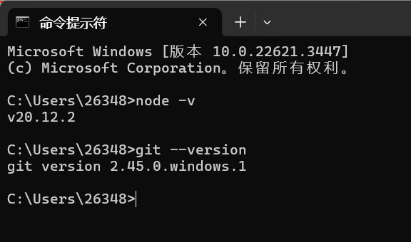


# 3. 安装hexo

在终端输入**nmp install hexo-cli -g**安装hexo。

安装完成后，输入 **hexo --version** 出现正常提示则说明安装成功。

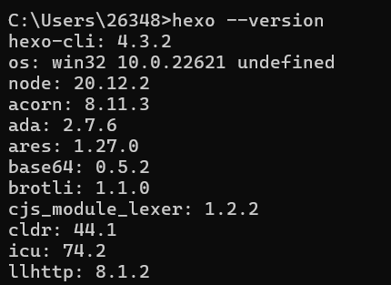


## 3.1 初始化博客空间

1. 接着输入 **hexo init 你的博客名字（下文称为blog）** 初始化博客

2. 在bash命令框输入 **cd 你的博客名字** 按enter进入刚初始化的博客空间
3. 输入 **hexo g** 命令编译博客空间
4. 输入 **hexo s** 命令启动hexo服务功能，执行完后打开上图显示的 http://localhost:4000/ ，就可以看到我们的hexo博客已经在本地部署成功了。

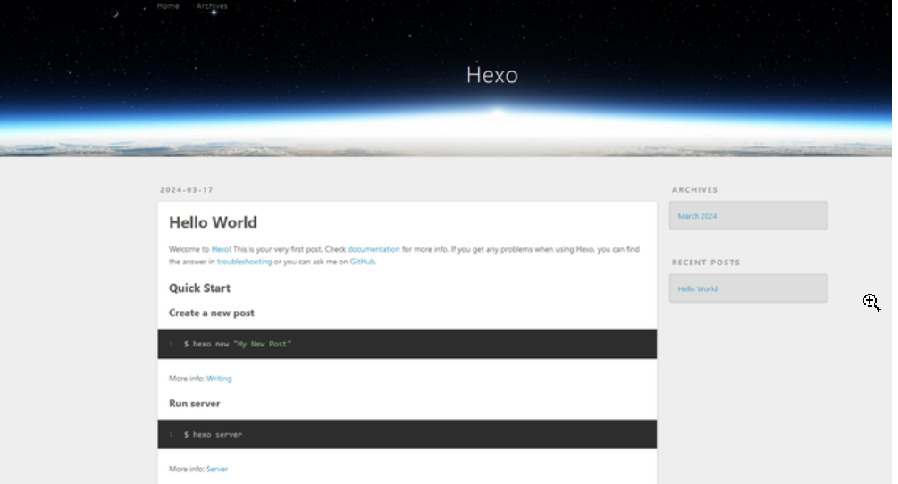

5. 安装butterfly，在终端输入 **npm i hexo-theme-butterfly** [butterfly-github](https://github.com/jerryc127/hexo-theme-butterfly)，接着打开butterfly主题文件夹（\blog\node_modules\hexo-theme-butterfly），把_config.yml文件复制到我们项目的根目录下（\blog），并重新命名成 _config.butterfly.yml

6. 配置butterfly主题，接着打开项目的配置文件，拉到最下面找到这个配置，并把它改成butterfly，landscape此时就可以删除了。

   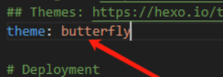

7. 此时我们再去在bash命令窗口执行 **hexo g 和 hexo s** 命令，此时butterfly主题设置成功。

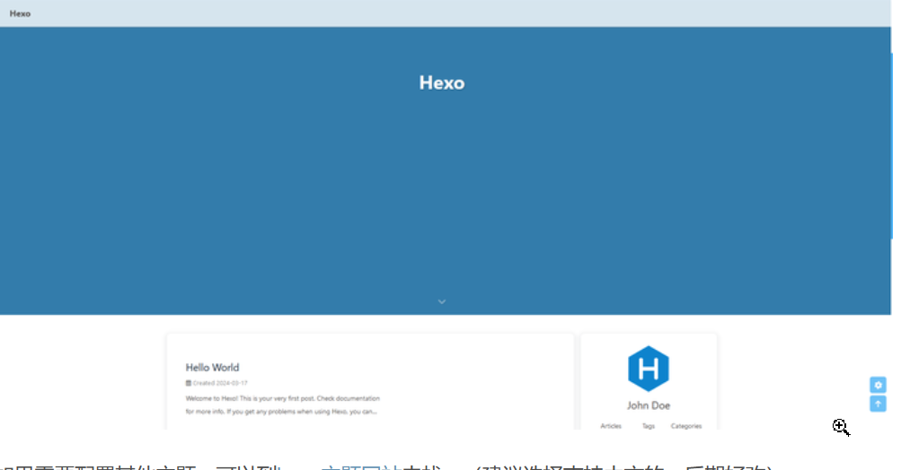


## 3.2 配置butterfly

### 3.2.1主页配置

参考下面的博客，非常详细。

[配置butterfly主题搭建博客网站主体UI框架_hexo butterfly-CSDN博客](https://blog.csdn.net/liudonglovehemin/article/details/131094362)


### 3.2.2设置头像，logo，主页背景

1. 创建 **\log\source\img** 文件夹

   用于存放blog需要的图片

   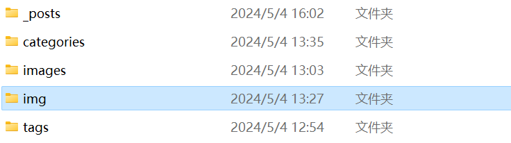

2. 修改 _config.butterfly.yml文件

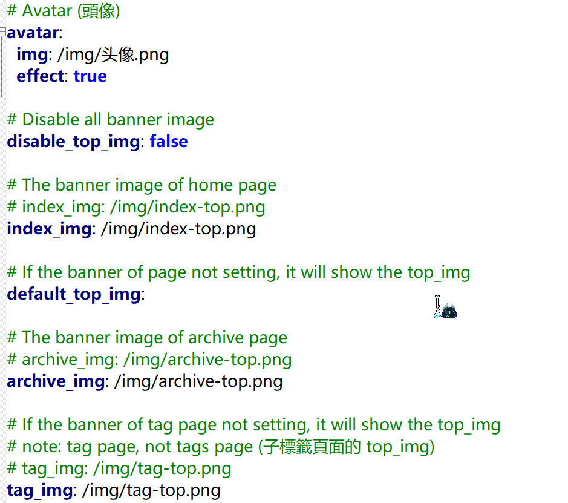

3. 输入 `hexo g`编译，产生html和其他配置文件位置为：**\blog\public**

### 3.2.3 tags，category，achieve等特殊界面

1. tags

   前往博客的根目录，执行`hexo new page tags`

   你會找到 **source/tags/index.md** 這個文件，修改如下

   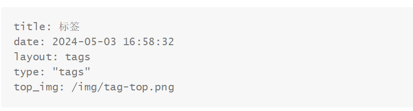

   尤其要加上 **type: "tags"** ，然后终端输入 **hexo g** 编译生成各个配置文件，其中top_img为tags主页的背景图。

2. category配置类似tags

   前往博客的根目录，执行`hexo new page categories`

   你會找到 **source/categories/index.md** 這個文件，修改如下

   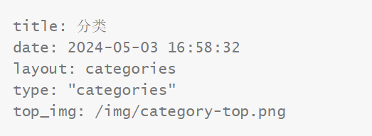

   尤其要加上 **type: "categories"** ，然后终端输入 **hexo g** 编译生成各个配置文件，其中top_img为tags主页的背景图。


3. achieve

   直接在 _config.butterfly.yml文件中配置即可，不必另行配置。


# 4. 解决blog内部用图在typora和hexo中不能同时显示的问题

## 4.1在hexo中显示

[hexo官方解决文档](https://hexo.io/zh-cn/docs/asset-folders)

1. 简单方法：建立`source/images` 文件夹中。然后通过类似于 `` 的方法访问它们。

2. 复杂方法：（但是管理资源非常方便，推荐）将 `config.yml` 文件中的 `post_asset_folder` 选项设为 `true` 来打开。

   ```
   _config.yml
   post_asset_folder: true
   ```

   当资源文件管理功能打开后，Hexo将会在你每一次通过 `hexo new [layout] <title>` 命令创建新文章时自动在同位置创建一个文件夹。这个资源文件夹将会有与这个文章文件一样的名字。将所有与你的文章有关的资源放在这个关联文件夹中之后，你可以通过相对路径来引用它们，这样你就得到了一个更简单而且方便得多的工作流。

   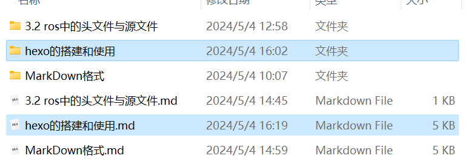

   安装hexo-asset-image，在终端输入 **npm install https://github.com/CodeFalling/hexo-asset-image**，如果安装不上就开启 fastgithub 或者其他加速器即可。

## 4.2 在typora中显示图片

在typora中通过重设图片存储位置[文件->偏好设置->图像]如下图，

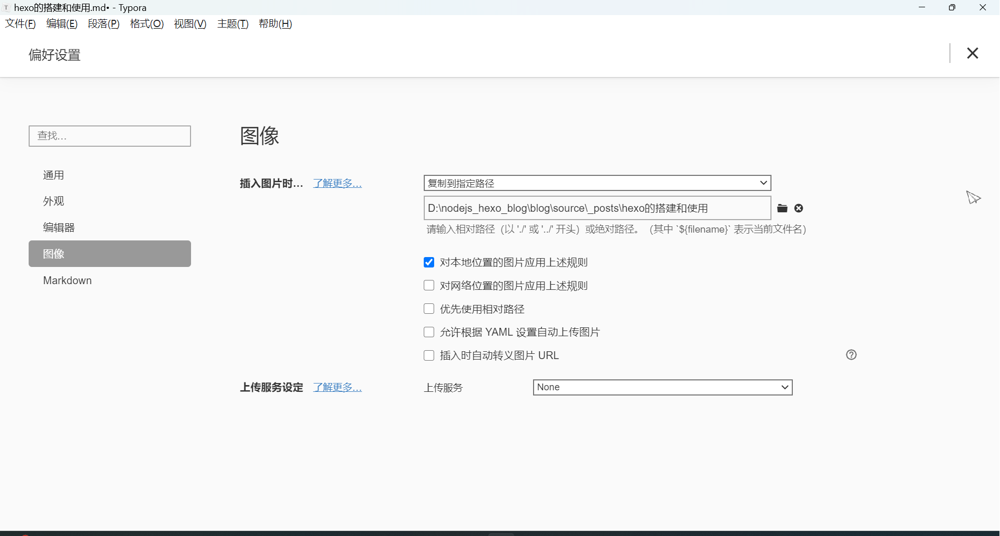

并将图片路径设置为 **./title/图片.png** 可以实现图片显示

```md


```


# 5. blog文章封面、标签、类别设置

在md文件的第一行输入 **三个"-"+enter** 就是头部。头部添加cover作为文章封面，可以使用相对路径和绝对路径，但是需要注意，引用绝对路径时，不能添加date那一项标签，否则会发生未知错误，多个tag用 `","` 分割。

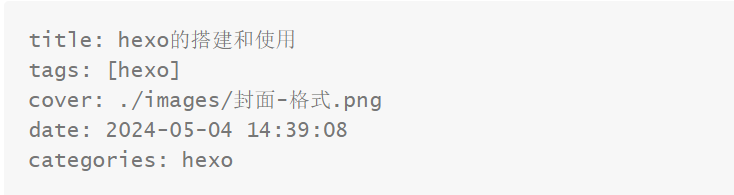

对于每次使用 hexo new生成md文档模板改动，打开scaffolds文件夹里面的post.md文件，进行自定义更改即可。


